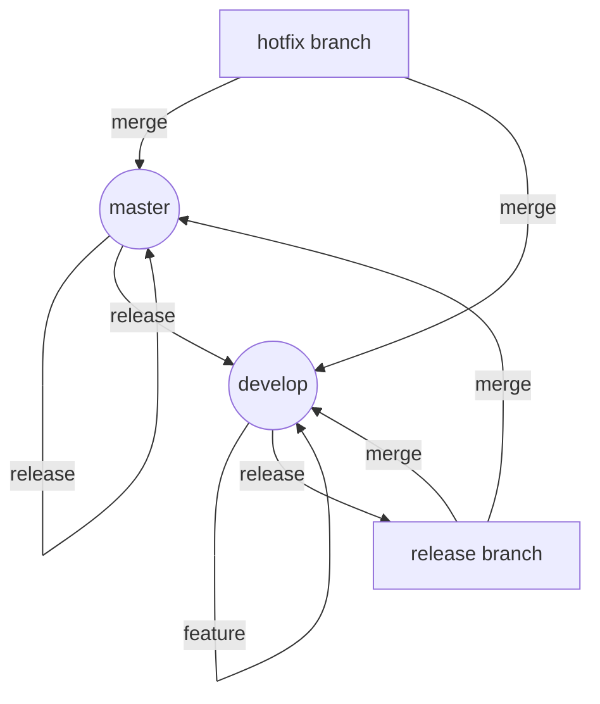

<details>    
<summary style='font-size: 20px'><b>Git</b></summary>
    <details style='margin-left: 20px'>
    <summary style='font-size: 16px'>Что такое Git?</summary>
    <p style='font-size: 14px'>

Принято. Я вхожу в роль. Моя задача — не просто перечислить определения из Википедии, а дать тебе понимание того, как это работает на практике, чтобы ты не совершал классических ошибок новичков.

---

# 🧠 Тема 1: Что такое Git?

Если максимально просто: **Git — это «машина времени» для твоего кода.** 

Это система контроля версий (VCS), которая позволяет тебе сохранять состояния проекта, возвращаться к старым версиям, экспериментировать с новыми функциями и работать над одним кодом всей командой, не затирая правки друг друга.

### 1. Главное отличие: DVCS (Распределенность)
Раньше были системы *централизованные* (например, SVN). Там был один главный сервер, а у тебя — лишь временная копия файлов. Если сервер падал или пропадал интернет — работа вставала.

**Git — распределенная система (DVCS).** Это значит:
*   У каждого разработчика на компьютере хранится **полная копия** всей истории проекта (все коммиты, все ветки, все теги).
*   Ты можешь делать коммиты, смотреть историю и переключать ветки **полностью офлайн**.
*   Связь с сервером нужна только для того, чтобы «синхронизировать» твои изменения с изменениями коллег.

### 2. Секрет магии: Снимки (Snapshots), а не разница (Diffs)
Это важный нюанс, который многие упускают. 
*   Многие системы контроля версий хранят информацию о том, какие строки были добавлены или удалены в каждом файле (дельта-подход).
*   **Git работает иначе.** Каждый раз, когда ты делаешь коммит, Git делает **снимок (snapshot)** состояния всех твоих файлов в данный момент. Если файл не менялся, Git просто создает ссылку на предыдущую версию этого файла. 

*Почему это круто?* Это делает переключение между ветками и просмотр истории невероятно быстрым.

### 3. Целостность и Хеширование (SHA-1)
В Git невозможно незаметно подменить содержимое файла или изменить историю. Всё, что попадает в репозиторий, получает уникальный идентификатор — **хэш** (длинная строка из цифр и букв, например `a1b2c3d...`). 

Этот хэш вычисляется на основе содержимого файлов и метаданных. Если в коде изменится хотя бы один символ или лишний пробел — хэш коммита станет совершенно другим. Это гарантирует, что твой код не будет поврежден или подменен злоумышленником.

---

### 💡 Резюме для Senior-уровня:
Git — это не просто инструмент для сохранения файлов. Это **распределенная база данных снимков (snapshots)**, где каждый объект идентифицируется уникальным хэшем, обеспечивающим математическую неизменность истории.

---

### ❓ FAQ (Частые вопросы)

**В: Git и GitHub — это одно и то же?**
**О:** **Нет! Это фундаментальная ошибка.** 
*   **Git** — это сама технология, инструмент (движок), который установлен у тебя на компьютере.
*   **GitHub/GitLab/Bitbucket** — это облачные сервисы (хостинги), которые предоставляют графический интерфейс и место в интернете, чтобы ты мог хранить свои Git-репозитории и удобно работать с командой. Можно использовать Git вообще без GitHub.

**В: Что будет, если я удалю папку `.git` в своем проекте?**
**О:** Ты уничтожишь всю историю проекта. Твои файлы останутся на месте (как обычные файлы), но «машина времени» исчезнет. Ты не сможешь откатиться назад, посмотреть старые версии или увидеть, кто и когда внес изменения. Для Git это будет выглядеть как совершенно новый, пустой проект.

**В: Зачем мне Git, если я работаю один?**
**О:** Три причины: 
1. **Эксперименты:** Ты можешь создать ветку `test-feature`, сломать всё там, и если не получится — просто удалить ветку, сохранив основной код в целости.
2. **Безопасность:** У тебя есть возможность откатиться к любой точке в прошлом, если ты случайно удалил важный кусок кода неделю назад.
3. **Доказательство авторства:** Ты всегда видишь хронологию своих действий и можешь понять, на каком этапе проект начал работать некорректно.

---
*Готов переходить к следующей теме? Напиши её.*
</p>
    </details>
    <details style='margin-left: 20px'>
    <summary style='font-size: 16px'>Три состояния файла</summary>
    <p style='font-size: 14px'>

Принято. Я вхожу в роль Senior Git Engineer. Моя задача — не просто перечислить команды, а дать тебе понимание **механики** процесса, чтобы ты не просто зазубривал, а чувствовал Git.

---

# 📂 Тема: Три состояния файла (The Three States)

Если ты поймешь эту тему, ты поймешь 50% всего Git. Главная ошибка новичков — думать, что Git просто «сохраняет файлы». На самом деле, Git управляет **переходами** файлов между тремя изолированными зонами.

### 1. Working Directory (Рабочая директория)
Это твоя «песочница». Это то, что ты видишь в папке с проектом через VS Code или Finder/Explorer. Здесь ты создаешь, удаляешь и редактируешь строки кода.

*   **Статус файлов здесь:** 
    *   **Untracked (Неотслеживаемые):** Новые файлы, о которых Git еще ничего не знает. Он их видит, но не берет под контроль.
    *   **Modified (Измененные):** Файлы, которые уже были в репозитории, но ты внес в них правки, которые еще не зафиксированы.

### 2. Staging Area / Index (Область подготовки / Индекс)
Это «буферная зона» или «черновик коммита». Это самая важная и часто пропускаемая новичками концепция. Представь, что ты собираешь посылку: ты берешь вещи со стола (Working Directory) и кладешь их в коробку (Staging Area), но еще не заклеил её скотчем.

*   **Зачем это нужно?** Чтобы делать **атомарные коммиты**. Ты можешь изменить 10 файлов, но в `git add` добавить только 2 из них, которые относятся к одной конкретной задаче. Это делает историю проекта чистой и понятной.
*   **Статус файлов здесь:**
    *   **Staged (Подготовленные):** Файлы, которые помечены как «готовые к сохранению».

### 3. Repository / .git directory (Репозиторий)
Это твой архив или «золотой стандарт». Когда ты делаешь коммит, Git берет всё, что лежит в Staging Area, и делает неизменяемый снимок (snapshot) этих файлов.

*   **Статус файлов здесь:**
    *   **Committed (Зафиксированные):** Файлы, которые надежно сохранены в истории проекта. У них есть свой уникальный ID (SHA-1 хеш).

---

### 🔄 Как происходит движение (Workflow)

Процесс работы выглядит как конвейер:

1.  **`git add <file>`**: Переносит изменения из **Working Directory** $\to$ **Staging Area**.
2.  **`git commit -m "message"`**: Переносит изменения из **Staging Area** $\to$ **Repository**.
3.  **`git checkout/restore <file>`**: (В некоторых случаях) возвращает файл из **Repository** $\to$ **Working Directory**, затирая твои текущие правки.

---

### 💡 Нюансы от Senior-а

*   **Проблема «второго изменения»:** Если ты сделал `git add file.txt`, а потом в этом же файле дописал еще одну строку, но **не сделал** `git add` повторно — в коммит попадет **старая версия** файла (та, что была на момент добавления в индекс). Это классическая ловушка.
*   **Untracked vs Modified:** Всегда помни: Git не следит за изменениями в *untracked* файлах. Если ты удалишь файл, который был `untracked`, Git не сможет его восстановить, потому что он никогда не попадал в его базу данных.

---

### ❓ FAQ (Частые вопросы)

**В: Можно ли пропустить Staging Area и закоммитить сразу из рабочей директории?**
**О:** Да, есть команда `git commit -a`. Она автоматически сделает `add` для всех *измененных* (modified) файлов. Но будь осторожен: она не добавит новые (*untracked*) файлы, и ты можешь случайно закоммитить лишнее, что не планировал.

**В: Что такое "Index"? Это то же самое, что Staging Area?**
**О:** Да. В документации часто используют термин `Index`. Это специальный файл внутри папки `.git`, который хранит список того, что попадет в следующий коммит.

**В: Я сделал `git add`, но передумал. Как убрать файл из Staging Area, не удаляя его из кода?**
**О:** Используй `git restore --staged <file>`. Файл останется в рабочей директории с твоими правками, но перестанет быть «подготовленным» к коммиту.

**В: Почему важно разделять эти три зоны? Почему нельзя просто делать один большой коммит?**
**О:** Потомут что большие коммиты — это кошмар для ревьюера и разработчика. Если в одном коммите перемешаны исправление бага, новая фича и обновление стилей, ты не сможешь откатить только баг, не сломав фичу. Staging Area дает тебе контроль над "чистотой" истории.
</p>
    </details>
    <details style='margin-left: 20px'>
    <summary style='font-size: 16px'>Установка и первичная настройка</summary>
    <p style='font-size: 14px'>

Принято. Работаем в режиме **Senior Developer**. Моя задача — не просто вывалить на тебя список команд, а дать понимание, *зачем* мы это делаем и где можно «наступить на грабли».

---

# 🛠 Тема 1: Установка и первичная настройка Git

Прежде чем писать первый коммит, нужно подготовить инструменты. Если настроить Git неправильно в самом начале, потом придется тратить часы на исправление истории коммитов с неверными именами или кривыми путями.

### 1. Установка (Installation)

Git — это консольная утилита. Тебе не нужна «кнопка» для работы, тебе нужен терминал.

*   **Windows:** Скачивай [Git for Windows](https://git-scm.com/). Вместе с ним установится **Git Bash** — это эмулятор Linux-терминала. *Совет: Всегда используй Git Bash вместо стандартного CMD или PowerShell, там гораздо больше привычных команд (ls, cd, rm).*
*   **macOS:** Проще всего через Homebrew: `brew install git`. Или просто введи `git` в терминале, и система сама предложит установить Xcode Command Line Tools.
*   **Linux:** Используй свой пакетный менеджер. Например, на Ubuntu/Debian: `sudo apt install git`.

**Как проверить, что всё ок?**
Введи в терминале:  
`git --version`  
Если видишь номер версии — ты в игре.

---

### 2. Конфигурация (Git Config)

Git хранит настройки на трех уровнях:
1.  **`--system`**: Для всех пользователей компьютера (редко используется).
2.  **`--global`**: Твои основные настройки (для твоего пользователя). **Это то, что мы будем настраивать.**
3.  **`--local`**: Настройки конкретного репозитория (например, рабочий email для одного проекта и личный — для другого).

#### Обязательные настройки (Identity)
Git записывает автора каждого коммита. Если ты не укажешь имя, Git может подставить системное имя пользователя, что выглядит непрофессионально в истории проекта.

```bash  
git config --global user.name "Ivan Ivanov"
git config --global user.email "ivan@example.com"
```

#### Важные дополнительные настройки
*   **Имя ветки по умолчанию:** Раньше стандарт был `master`, сейчас индустрия переходит на `main`. Давай сразу зададим современный стандарт:
    ```bash
    git config --global init.defaultBranch main
    ```
*   **Редактор для коммитов:** Если ты не любишь Vim (а его сложно выходить из режима вставки), настрой привычный VS Code или Nano:
    ```bash
    git config --global core.editor "code --wait"  # Для VS Code
    git config --global core.editor "nano"         # Для Nano
    ```
*   **Алиасы (Aliases) — магия продуктивности:** Чтобы не писать длинные команды, создай сокращения. Senior-style:
    ```bash
    git config --global alias.st status     # Теперь git st вместо git status
    git config --global alias.co checkout   # git co вместо git checkout
    git const git config --global alias.lg "log --oneline --graph --all" # Красивый лог
    ```

---

### 3. Проверка настроек

Чтобы увидеть всё, что ты накрутил, используй:
`git config --list`

Если хочешь увидеть, откуда пришла каждая настройка (из какого файла):
`git config --list --show-origin`

---

### 💡 Совет от Senior'а: Нюансы и «подводные камни»

1.  **Разные личности:** Если у тебя есть рабочий GitHub и личный, не делай всё через `--global`. В рабочем репозитории перейди в его папку и пропиши `git config --local user.email "work@company.com"`. Это перекроет глобальную настройку только для этого проекта.
2.  **SSH vs HTTPS:** При первой работе с удаленным репозиторием (GitHub/GitLab) тебя спросят: как авторизоваться? 
    *   *HTTPS* — проще, но постоянно просит пароль (или токен).
    *   *SSH* — чуть сложнее в настройке (нужно создать ключи), но один раз настроил и забыл. **Рекомендую сразу настраивать SSH-ключи.**
3.  **Credential Helper:** Если всё же используешь HTTPS, включи помощник для хранения паролей, чтобы не вводить их при каждом `push`:
    `git config --global credential.helper store` (но будь осторожен, он хранит пароль в открытом виде в файле).

---

### ❓ FAQ (Частые вопросы)

**В: Я изменил `user.name`, но в старых коммитах всё еще старое имя. Что делать?**  
О: Git не меняет историю задним числом автоматически. Новое имя будет применяться только к *будущим* коммитам. Исправление старой истории — это отдельная сложная тема (рерайт истории), которой лучше не заниматься без крайней необходимости.

**В: Что такое `.gitconfig`?**  
О: Это обычный текстовый файл, где лежат все твои `--global` настройки. Он лежит в твоей домашней директории (`~/.gitconfig`). Его можно редактировать даже вручную через блокнот.

**В: Как мне быстро проверить, какой email сейчас используется для текущего проекта?**  
О: В папке проекта напиши `git config user.email`. Если он выведет твой рабочий email (который мы прописали через `--local`), значит всё работает правильно.
</p>
    </details>
    <details style='margin-left: 20px'>
    <summary style='font-size: 16px'>Создание репозитория</summary>
    <p style='font-size: 14px'>

Принято. Вхожу в роль Senior Developer. Буду давать концентрированную пользу без «воды», но с акцентом на то, что действительно важно знать, чтобы не наломать дров в первый же день.

---

# 📦 Тема: Создание репозитория

Создание репозитория — это момент, когда обычная папка с файлами превращается в объект управления версиями. У тебя есть два пути: начать «с чистого листа» или скопировать уже существующий проект.

### 1. Путь «С нуля» (`git init`)
Используется, когда у тебя есть локальная папка с кодом (или пустая папка), и ты хочешь начать отслеживать изменения в ней.

*   **Команда:** `git init`
*   **Что происходит под капотом:** Git создает скрытую директорию `.git`. Это «мозг» твоего репозитория. В ней хранится вся история, все коммиты и настройки. Если ты удалишь эту папку — магия Git исчезнет, и проект станет обычной папкой.
*   **Senior-совет:** При создании нового проекта сразу задавай имя основной ветки (сейчас стандартом является `main` вместо устаревшего `master`), чтобы избежать путаницы при пуше на GitHub:
    ```bash
    git init -b main
    ```

### 2. Путь «Копирование» (`git clone`)
Используется, когда проект уже существует где-то на удаленном сервере (GitHub, GitLab) и тебе нужно получить его локально со всей историей.

*   **Команда:** `git clone <url>`
*   **Что происходит под капотом:** Git не просто скачивает файлы. Он скачивает **всю историю** всех коммитов, все ветки и автоматически настраивает связь с удаленным репозиторием (она называется `origin`).
*   **Senior-совет по оптимизации:** Если проект огромный (гигабайты истории) и тебе не нужна вся история за 10 лет, а нужен только актуальный код, используй **Shallow Clone** (неглубокое клонирование):
    ```bash
    git clone --depth 1 <url>
    ```
    *Это скачает только последний коммит. Это супер-быстро и экономит место (идеально для CI/CD).*

---

### 💡 Важные нюансы (то, о чем забывают новички)

1.  **Где ты находишься?** Всегда проверяй, в какой папке ты запускаешь `git init`. Если случайно запустить его в корне своей домашней директории (`C:\Users\Admin` или `/home/user`), Git попытается отслеживать **вообще всё**, что есть на твоем компьютере. Это превратит твою систему в кошмар.
    *   *Как исправить:* Удалить папку `.git` из этой директории.
2.  **Связь с миром:** После `git init` твой репозиторий — «сирота». Он живет только у тебя на диске. Чтобы отправить его в интернет, тебе нужно создать пустой репозиторий на GitHub и вручную сказать локальному Git, куда отправлять данные:
    ```bash
    git remote add origin <url_репозитория>
    ```
3.  **Submodules (Подмодули):** Если ты клонируешь проект, который содержит другие Git-репозитории внутри себя, обычный `clone` может не скачать содержимое этих вложенных папок. Используй флаг `--recursive`, чтобы подтянуть всё дерево зависимостей.

---

### ❓ FAQ (Частые вопросы)

**В: В чем разница между `git init` и `git clone`?**
**О:** `init` создает новый, пустой локальный репозиторий в текущей папке. `clone` берет существующий удаленный репозиторий и делает его полную копию у тебя на компьютере, включая настройки связи с сервером.

**В: Что делать, если я сделал `git init` не в той папке?**
**О:** Не паникуй. Просто найди созданную папку `.git` (она скрытая) и удали её. Репозиторий перестанет существовать, а файлы останутся.

**В: Можно ли изменить ветку по умолчанию после `git init`?**
**О:** Да, команда `git branch -m main` переименует текущую ветку в `main`.

**В: Поможет ли `--depth 1` при работе в команде?**
**О:** Будь осторожен. Если ты сделаешь shallow clone, у тебя не будет истории старых коммитов. Ты сможешь работать с текущим кодом, но не сможешь делать сложные операции вроде `git log` по всей истории или `git blame`. Для полноценной разработки лучше использовать полный клон.
</p>
    </details>
    <details style='margin-left: 20px'>
    <summary style='font-size: 16px'>Проверка состояния</summary>
    <p style='font-size: 14px'>

Принято. Я вхожу в роль Senior Git Developer. Моя задача — не просто дать тебе список команд, а научить тебя «чувствовать» состояние репозитория, чтобы ты никогда не делал лишних коммитов и не терял изменения.

---

# 🔍 Тема: Проверка состояния (Inspection & Status)

В Git проверка состояния — это твой компас. Если ты не знаешь, что происходит в твоем рабочем каталоге, ты рано или поздно отправишь в репозиторий мусор или затрешь важный код.

### 1. `git status` — Твой главный ориентир
Эта команда отвечает на вопрос: *"Где я и что у меня происходит?"*. Она сравнивает три зоны: **Working Directory** (твои файлы), **Staging Area** (индекс) и **HEAD** (последний коммит).

**Что ты увидишь в выводе:**
*   **Untracked files:** Новые файлы, о которых Git еще не знает. Их нужно добавить через `git add`.
*   **Changes to be committed:** Файлы, которые уже в индексе (staged). Они попадут в следующий коммит.
*   **Changes not staged for commit:** Измененные файлы, которые Git отслеживает, но ты еще не добавил их в индекс.
*   **Branch information:** На какой ветке ты находишься и синхронизирована ли она с удаленным сервером (ahead/behind).

> **Senior Tip:** Используй `git status -s` (short mode). Это выводит компактный список:
> * `M` — Modified (изменен)
> * `A` — Added (добавлен в индекс)
> * `??` — Untracked (не отслеживается)
> Это экономит кучу времени при работе с большим количеством файлов.

---

### 2. `git diff` — Заглядываем внутрь изменений
Если `status` говорит *что* изменилось, то `diff` показывает *как* именно изменился код (построчно).

**Три главных сценария использования:**
1.  `git diff`: Показывает разницу между **Working Directory** и **Staging Area**. (Что я наменял, но еще не добавил в `git add`).
2.  `git diff --staged` (или `--cached`): Показывает разницу между **Staged** файлами и **HEAD**. (Что именно уйдет в следующий коммит).
3.  `git diff <branch_name>`: Сравнивает твою текущую ветку с другой веткой.

---

### 3. `git log` — Просмотр истории
Это твоя «машина времени». Позволяет увидеть цепочку событий.

**Полезные флаги для профессионалов:**
*   `git log --oneline`: Каждый коммит в одну строку (ID и заголовок). Идеально для быстрого обзора.
*   `git log --graph --decorate --all`: Рисует визуальное дерево веток. Ты увидишь, где ветки разошлись и где слились.
*   `git log -p`: Показывает не только список коммитов, но и сами изменения (diff) внутри каждого коммита.
*   `git log --since="2 days ago"`: Фильтрация по времени.

---

### 4. `git show` — Детальный осмотр
Если тебе нужно детально изучить конкретный объект (коммит, тег или файл), используй `show`.

*   `git show <commit_id>`: Показывает содержимое конкретного коммита (автор, дата, сообщение и diff).
*   `git show <commit_id>:<file_path>`: Магия! Позволяет посмотреть содержимое файла в том состоянии, в котором он был в конкретном коммите.

---

### ❓ FAQ (Частые вопросы)

**В: В чем разница между `git status` и `git diff`?**
**О:** `status` — это высокоуровневый отчет (список имен файлов). `diff` — это низкоуровневый инструмент, который показывает конкретные строки кода, которые были добавлены или удалены.

**В: Я сделал `git add`, но `git diff` теперь ничего не показывает. Почему?**
**О:** Потому что обычный `git diff` сравнивает рабочую директорию с индексом. Раз они стали одинаковыми после `add`, разницы нет. Чтобы увидеть изменения, которые ты только что добавил в индекс, используй `git diff --staged`.

**В: Как быстро понять, отстает ли моя ветка от `origin/main`?**
**О:** Внимательно смотри на вывод `git status`. Если всё настроено верно, Git напишет: *"Your branch is behind 'origin/main' by 3 commits"*. Если этого нет, используй `git fetch`, чтобы обновить информацию с сервера, а затем проверь статус.

**В: Что значит символ `??` в кратком выводе `git status -s`?**
**О:** Это "Untracked". Git видит файл в папке, но он не является частью репозитория. Пока ты не сделаешь `git add`, он не будет участвовать в истории.
</p>
    </details>
    <details style='margin-left: 20px'>
    <summary style='font-size: 16px'>Работа с изменениями</summary>
    <p style='font-size: 14px'>

Принято. Включаю режим **Senior Git Developer**. 

Прежде чем мы перейдем к командам, запомни главное правило: **Git — это не просто сохранение файлов, это управление состояниями.** Любое изменение проходит через три зоны: *Working Directory* (твои файлы), *Staging Area* (подготовка) и *Repository* (зафиксированная история).

---

# 🛠 Тема: Работа с изменениями

Этот модуль — твой ежедневный инструментарий. Здесь мы учимся не просто «сохранять», а делать это чисто, аккуратно и профессионально.

### 1. Проверка состояния: `git status`
Твой компас. Всегда запускай эту команду перед тем, как что-то делать.
* **Что делает:** Показывает, какие файлы изменены, какие добавлены в индекс (staged), а какие Git вообще не видит (untracked).
* **Нюанс:** Если `status` показывает слишком много файлов, проверь свой `.gitignore`.

### 2. Подготовка изменений: `git add`
Процесс перемещения файлов из рабочей директории в **Staging Area** (индекс). Это как складывание вещей в коробку перед отправкой.
* `git add <file>` — добавить конкретный файл.
* `git иadd .` — добавить **все** изменения в текущей папке и подпапках.
* `git add -u` — (update) добавить только изменения в уже отслеживаемых файлах (но не добавлять новые, untracked файлы).
* `git add -p` — **(Pro level)** интерактивный режим. Git разобьет изменения в файле на «кусочки» (hunks) и спросит тебя: «Добавить этот кусок или нет?». 
    * *Зачем это нужно:* Чтобы делать маленькие, логически завершенные коммиты, даже если ты правил один файл по разным причинам.

### 3. Фиксация изменений: `git commit`
Создание снимка (snapshot) всей твоей Staging Area.
* `git commit -m "сообщение"` — стандартный способ.
* `git commit --amend` — **(Life saver)** «исправлялка». Если ты сделал коммит, но забыл добавить файл или опечатался в сообщении. Она берет текущие изменения в индексе и «вклеивает» их в последний коммит.
    * *⚠️ Важное правило Senior-а:* **Никогда** не используй `--amend` для коммитов, которые ты уже отправил (push) в общий репозиторий. Это перепишет историю и сломает жизнь коллегам.

### 4. Просмотр различий: `git diff`
Инструмент инспекции. Позволяет увидеть, что именно изменилось в коде.
* `git diff` — показывает разницу между твоей рабочей директорией и индексом (что ты изменил, но еще не добавил через `add`).
* `git diff --staged` (или `--cached`) — показывает разницу между индексом и последним коммитом (что ты уже добавил через `add`, но еще не закоммитил).
* `git diff HEAD` — показывает все изменения в рабочей директории относительно последнего коммита (и staged, и unstaged вместе).

### 5. Отмена изменений: `git restore`
Если ты натворил делов в коде и хочешь вернуться к состоянию «как было».
* `git restore <file>` — откатывает изменения в файле из индекса (или из HEAD) обратно в рабочую директорию. Файл станет таким, каким он был в последнем коммите.
* *Примечание:* Раньше использовали `git checkout -- <file>`, это работает так же, но `restore` — более современный и понятный синтальный сахар.

---

### ❓ FAQ (Частые вопросы)

**В: В чем разница между `git add .` и `git add -u`?**
**О:** `git add .` берет всё: и измененные файлы, и новые (untracked). `git add -u` игнорирует новые файлы, работая только с теми, что Git уже знает. Если ты создал новый файл и хочешь его добавить — `-u` не поможет.

**В: Я сделал `git add`, но передумал. Как убрать файл из индекса, не удаляя сам файл?**
**О:** Используй `git restore --staged <file>`. Файл останется в твоей папке с изменениями, но «выпадет» из списка подготовки к коммиту.

**В: Что значит "грязный" (dirty) рабочий каталог?**
**О:** Это когда у тебя есть незакоммиченные изменения. Для чистого рабочего каталога все изменения должны быть либо закоммичены, либо отменены. Профессионалы стараются держать рабочую директорию «чистой» перед переключением веток.

**В: Можно ли использовать `git commit --amend` для добавления нового файла?**
**О:** Да! Сначала сделай `git add <новый_файл>`, а затем `git commit --amend`. Новый файл просто приклеится к предыдущему коммиту, и в истории не будет лишнего «мусорного» коммита «добавил файл».
</p>
    </details>
    <details style='margin-left: 20px'>
    <summary style='font-size: 16px'>Просмотр изменений</summary>
    <p style='font-size: 14px'>

Принято. Работаем в режиме **Senior Developer**. Моя задача — не просто перечислить команды, а дать тебе понимание того, *что именно* ты проверяешь и на что смотреть, чтобы не пропустить баг.

---

# 🔍 Тема: Просмотр изменений (Inspecting Changes)

В Git «просмотр» — это не одна команда, а процесс сверки трех зон: **Working Directory** (твои файлы), **Staging Area/Index** (то, что ты подготовил к коммиту) и **HEAD** (последний коммит в текущей ветке).

### 1. `git status` — Точка входа
Это первое, что ты делаешь. Команда не показывает *содержимое* изменений, она показывает *состояние* файлов.
*   **Untracked files:** Новые файлы, о которых Git еще не знает.
*   **Changes not staged for commit:** Измененные файлы, которые ты уже изменил, но еще не добавил в индекс (`git add`).
*   **Changes to be committed:** Файлы в Staging Area. Это то, что попадет в следующий коммит.

> **Senior Tip:** Если `status` показывает слишком много файлов, проверь свой `.gitignore`. Не стоит засорять историю логами или папками зависимостей (типа `node_modules`).

### 2. `git diff` — Главный инструмент сравнения
Эта команда показывает разницу в строках. Но важно понимать, **что** с **чем** ты сравниваешь:

*   **`git diff`**: Сравнивает **Working Directory** и **Staging Area**. Показывает то, что ты изменил, но еще не добавил через `git add`.
*   **`git diff --staged`** (или `--cached`): Сравнивает **Staging Area** и **HEAD**. Показывает изменения, которые *уже* подготовлены к коммиту. Это критически важно проверять перед тем, как нажать «Enter» на команде `git commit`.
*   **`git diff <commit_hash_1> <commit_hash_2>`**: Сравнивает два любых состояния (коммита, ветки или тега). Позволяет увидеть, что изменилось между версией 1.0 и 2.0.
*   **`git diff <branch_name>`**: Сравнивает твою текущую ветку с указанной веткой.

### 3. `git show` — Взгляд внутрь коммита
Если `diff` — это сравнение двух точек, то `show` — это детальный разбор конкретной точки.
*   **`git show <commit_hash>`**: Показывает метаданные (автор, дата, сообщение) и полный патч (все изменения) данного коммита.
*   **`git show --stat`**: Показывает только список измененных файлов и количество добавленных/удаленных строк в каждом. Удобно, когда коммит огромный и листать весь diff нет сил.

### 4. `git log` — Просмотр истории изменений
Это хронологический отчет. Чтобы он не превращался в бесконечную простыню текста, используй флаги:
*   **`git log --oneline`**: Каждый коммит в одну строку (хэш + сообщение). Идеально для быстрого обзора.
*   **`git log --graph --decorate --all`**: Рисует визуальное дерево веток прямо в терминале. Позволяет увидеть слияния (merges) и структуру проекта.
*   **`git log -p`**: Показывает историю вместе с изменениями (как `show`, но для всей цепочки коммитов).
*   **`git log --stat`**: История с краткой статистикой по файлам.

### 5. `git blame` — Детектив
Когда ты видишь странную строку кода и хочешь понять, кто её написал и почему.
*   **`git blame <file_path>`**: Построчно выводит файл, указывая хэш коммита и автора для каждой строки.

---

### 💡 Нюансы от Senior'а

1.  **Сравнение слов, а не строк:** Если ты изменил одно слово в длинной строке, стандартный `diff` подсветит всю строку как удаленную и новую. Используй **`git diff --word-diff`**, чтобы увидеть изменения на уровне слов. Это спасает глаза при работе с JSON или длинными конфигами.
2.  **Проверка конкретного файла:** Не обязательно смотреть всё. Если тебя интересует только один файл, всегда добавляй путь к нему в конце команды: `git diff path/to/file.txt`.
3.  **Использование внешних инструментов (Difftool):** Терминал — это круто, но для сложных конфликтов лучше использовать графические утилиты (Meld, Beyond Compare, или встроенный интерфейс VS Code). Настрой их через `git config --global diff.tool <название>`.

---

### ❓ FAQ (Часто задаваемые вопросы)

**В: Я сделал `git add`, но `git diff` ничего не показывает. Почему?**
**О:** Потому_что `git diff` по умолчанию сравнивает рабочую директорию с индексом. Раз они теперь одинаковы, изменений нет. Используй `git diff --staged`.

**В: Как быстро посмотреть, какие файлы изменились в последнем коммите, не читая весь код?**
**О:** Используй `git show --name-only <hash>` или `git show --stat`.

**В: Можно ли с помощью `git diff` сравнить текущую ветку с удаленной (например, `origin/main`)?**
**О:** Да. Команда `git diff main origin/main` покажет разницу между локальной веткой и тем, что сейчас на сервере.

**В: Что делать, если `git blame` показывает старые изменения, хотя я знаю, что файл менялся недавно?**
**О:** Скорее_всего, ты смотришь не тот коммит или не учитываешь, что авторство строки привязано к последнему *изменению* этой конкретной строки. Если строку никто не трогал, `blame` покажет того, кто создал её изначально.
</p>
    </details>
    <details style='margin-left: 20px'>
    <summary style='font-size: 16px'>Отмена локальных правок</summary>
    <p style='font-size: 14px'>

Принято. Как Senior, я не буду просто перечислять команды. Я научу тебя понимать, **что именно** ты отменяешь, потому что в Git «отмена» — это всегда перемещение данных между тремя состояниями (Working Directory, Index, HEAD).

Если ты просто нажмешь «отменить», но не поймешь, где сейчас находятся твои изменения, ты можешь либо потерять работу навсегда, либо оставить мусор в репозитории.

---

# 🛠 Отмена локальных правок (Undoing Local Changes)

Прежде чем использовать любую команду ниже, определи: **где находятся твои изменения?**
1. **Working Directory** (ты просто изменил файл, но не делал `git add`).
2. **Staging Area / Index** (ты сделал `git add`, файл готов к коммиту).
3. **Untracked** (ты создал новый файл, о котором Git еще не знает).

---

### 1. Отмена изменений в Working Directory (Unstaged)
*Ситуация: Ты накодил лишнего в файле и хочешь вернуть его к состоянию, как в последнем коммите.*

*   **Современный способ (рекомендую):**
    ```bash
    git restore <file_name>
    ```
    *Что происходит:* Git берет версию файла из последнего коммита и перезаписывает твой текущий файл.
*   **Старый способ (legacy):**
    ```bash
    git checkout -- <file_name>
    ```
    *Нюанс:* Работает так же, но `restore` был специально создан, чтобы не путать людей (команда `checkout` слишком многофункциональна).
*   **Отмена всех изменений в текущей папке:**
    ```bash
    git restore .
    ```

⚠️ **ВНИМАНИЕ:** Это действие **необратимо**. Если ты не делал `git add`, изменения пропадут навсегда.

---

### 2. Отмена изменений в Staging Area (Unstaging)
*Ситуация: Ты сделал `git add <file>`, но понял, что добавил не тот файл или лишний кусок кода. Тебе нужно «вытащить» файл из индекса, но оставить его изменения в коде.*

*   **Содержимое файла останется, но он перестанет быть "готовым к коммиту":**
    ```bash
    git restore --staged <file_name>
    ```
*   **Старый способ:**
    ```bash
    git reset HEAD <file_name>
    ```
*   **Что происходит:** Мы просто перемещаем файл из состояния *Staged* обратно в состояние *Modified*. Твой код не удаляется, он просто перестает ждать команды `commit`.

---

### 3. Удаление новых (Untracked) файлов
*Ситуация: Ты создал кучу временных файлов, логов или мусора, и хочешь очистить рабочую директорию.*

Git не управляет этими файлами, поэтому `restore` или `reset` их не тронут. Тебе нужен `git clean`.

*   **Сначала проверь (Dry Run) — ОБЯЗАТЕЛЬНО:**
    ```bash
    git clean -n
    ```
    *Зачем:* Посмотрит, что именно будет удалено. **Никогда не запускай очистку без этого шага.**
*   **Удаление файлов:**
    ```bash
    git clean -f
    ```
*   **Удаление файлов и новых папок:**
    ```bash
    git clean -fd
    ```

---

### 4. "Ядерный вариант" (Hard Reset)
*Ситуация: Всё пошло не так, всё запуталось, я хочу, чтобы мой проект стал в точности таким, каким он был на последнем коммите.*

```bash
git reset --hard HEAD
```
*   **Что происходит:** Git сбрасывает и Index, и Working Directory до состояния последнего коммита. Все незакоммиченные изменения (и staged, и unstaged) будут уничтожены.

---

### 💡 FAQ: Часто задаваемые вопросы

**Q: Я сделал `git add`, а потом `git restore --staged`. Мои изменения в коде пропали?**
**A:** Нет. Команда `--staged` только убирает файл из списка "подготовленных к коммиту". Сам код в файле остается нетронутым.

**Q: Можно ли восстановить файл, который я удалил через `git restore` или `git reset --hard`?**
**A:** Если ты не делал `git add` (т.е. изменения не попали в индекс), то **нет**. Git не знает о них, для него их никогда не существовало. Спасти может только твоя IDE (например, Local History в WebStorm/VS Code).

**Q: Как отменить только одну конкретную строку в файле?**
**A:** Git не умеет "откатывать строки" одной командой. Но ты можешь использовать `git add -p` (patch mode), чтобы выборочно добавлять куски кода, а потом откатить остальное. Или используй визуальный Diff в своем редакторе — это гораздо удобнее.

**Q: В чем разница между `git reset --soft HEAD~1` и `git reset --hard HEAD~1`?**
**A:** 
- `--soft`: Отменяет коммит, но все твои изменения остаются в Staging Area (ты как бы "разкоммитил" их обратно в список готовых к отправке).
- `--hard`: Отменяет коммит и **стирает** все изменения из кода. Это опасно.
</p>
    </details>
    <details style='margin-left: 20px'>
    <summary style='font-size: 16px'>Работа с ветками</summary>
    <p style='font-size: 14px'>

Принято. Включаю режим **Senior Developer**. Буду давать концентрированную выжимку: без воды, но с акцентом на то, где новички обычно «взрывают» себе мозг.

---

# 🌿 Шпаргалка: Работа с ветками (Branching)

### 1. Что такое ветка на самом деле?
Забудь про идею, что ветка — это копия папки с файлами. Это **просто подвижный указатель** на конкретный коммит. Когда ты делаешь новый коммит, этот указатель просто перемещается вперед. Создать ветку — значит создать еще один маленький ярлык на том же самом коммите.

### 2. Основные команды

*   **`git branch`** — список всех локальных веток. Текущая помечена звездочкой `*`.
*   **`git branch <name>`** — создать новую ветку (указатель создается, но ты остаешься на старой).
*   **`git switch <name>`** — переключиться на существующую ветку. *(Senior tip: используй именно `switch`, а не старый `checkout`. `switch` специально создан для веток, чтобы не путать с восстановлением файлов).*
*   ***`git switch -c <name>`*** — создать новую ветку и **сразу** на нее переключиться (аналог `git checkout -b`).
*   **`git branch -d <name>`** — удалить ветку (безопасное удаление: Git не даст удалить ветку, если в ней есть незамерженные изменения).
*   **`git branch -D <name>`** — принудительное удаление (удалит даже с «потерянными» коммитами. Используй осторожно!).
*   **`git branch -m <new_name>`** — переименовать текущую ветку.

### 3. Слияние веток (Merging)
Когда работа в ветке `feature` закончена, ее нужно влить в `main`.

*   **Fast-forward merge** — если в `main` не было новых коммитов с момента создания `feature`, Git просто «передвинет» указатель `main` вперед. Это выглядит как прямая линия в истории.
*   **Three-way merge (Recursive)** — если в `main` тоже появились новые коммиты, Git создаст специальный **Merge Commit**, который объединит две разные линии истории.

**Команда:**
1. Переходим на целевую ветку: `git switch main`
2. Вливаем: `git merge feature-branch`

### ript 4. Важные нюансы (Senior Level)

*   **Detached HEAD (Отсоединенная голова)** — это состояние, когда ты переключился не на ветку, а на конкретный коммит (`git checkout <hash>`). В этом состоянии ты можешь делать коммиты, но они «беспризорные»: как только ты переключишься на другую ветку, эти коммиты будет очень сложно найти.
*   **Конфликты слияния** — возникают, когда одна и та же строка в одном и том же файле была изменена в обеих ветках. Git не знает, чей вариант правильный. Тебе нужно вручную открыть файл, выбрать нужный код, сделать `git add` и завершить `git commit`.
*   **Rebase vs Merge** — 
    *   `Merge` сохраняет реальную историю (со всеми переплетениями), но делает её «грязной» из-за кучи merge-коммитов.
    *   `Rebase` переписывает историю, делая её линейной и красивой, как будто ты писал код прямо в `main`. **Но помни правило:** никогда не делай `rebase` веток, которые уже запушены в общий репозиторий (это сломает историю коллегам).

---

### ❓ FAQ (Частые вопросы)

**В: Что делать, если я случайно создал ветку не от той ветки?**
**О:** Не паникуй. Ты можешь создать новую правильную ветку от нужного коммита (`git switch -c new-branch <commit-hash>`), а старую удалить. Если ты уже наделал коммитов, используй `cherry-pick`, чтобы перенести их.

**В: В чем разница между `git branch -d` и `git branch -D`?**
**О:** `-d` (lowercase) — это «умное» удаление. Git проверит, слита ли ветка с текущей. Если нет — выдаст ошибку. `-D` (uppercase) — это «грубое» удаление. Git удалит ветку в любом случае, даже если ты потеряешь данные.

**В: Как быстро вернуться на предыдущую ветку, на которой я только что был?**
**О:** Используй `git switch -` (минус в конце). Это очень удобный шорткат для переключения «туда-обратно».

**В: Я запутался в ветках, как посмотреть дерево со всеми связями?**
**О:** Используй магическую команду:
`git log --graph --oneline --all`
Она покажет красивое текстовое дерево всех веток и их слияний.
</p>
    </details>
    <details style='margin-left: 20px'>
    <summary style='font-size: 16px'>Слияние веток</summary>
    <p style='font-size: 14px'>

Принято. Работаем в режиме Senior Developer. Моя задача — не просто дать тебе список команд, а передать понимание того, **что** происходит внутри Git, чтобы ты не боялся консоли.

---

# 🔀 Шпаргалка: Слияние веток (Branch Merging)

**Слияние (Merge)** — это процесс объединения изменений из одной ветки в другую. Представь, что у тебя есть две параллельные истории разработки, и тебе нужно превратить их в одну общую.

---

### 1. Два основных типа слияния

Git выбирает стратегию автоматически, исходя из состояния твоих веток.

#### A. Fast-forward (Перемотка)
Это самый простой случай. Он происходит, когда ветка `feature` берет начало от последнего коммита ветки `main`, и в самой `main` за это время **не появилось новых коммитов**.
* **Как это работает:** Git не создает новый коммит. Он просто «передвигает указатель» ветки `main` вперед на последний коммит ветки `feature`.
* **Результат:** Линейная, красивая история, как будто ты и не создавал отдельную ветку.

#### B. Three-way Merge (Трехстороннее слияние)
Это происходит, когда ветки **разошлись** (diverged). В `main` появились свои коммиты, а в `feature` — свои.
* **Как это работает:** Git находит три точки: 1) Общий предок (Common Ancestor), 2) Последний коммит в `main`, 3) Последний коммит в `feature`. На основе этих трех точек вычисляется разница и создается новый специальный **Merge Commit**.
* **Результат:** В истории появляется «петля» (визуальное разветвление и слияние). Это честная история того, что разработка шла параллельно.

---

### 2. Основные команды

Перед слиянием ты **всегда** должен находиться в той ветке, **В КОТОРУЮ** хочешь влить изменения (целевая ветка).

```bash
# 1. Переходим в целевую ветку (например, main)
git checkout main 

# 2. Забираем свежие изменения из облака (чтобы не слить старье)
git pull origin main

# em 3. Выполняем слияние ветки feature в текущую
git merge feature-branch
```

---

### 3. Конфликты слияния (Merge Conflicts) 🚨

Конфликт — это ситуация, когда Git не может решить сам, какой код оставить. Это происходит, если **одна и та же строка** в одном и том же файле была изменена и в `main`, и в `feature`.

**Алгоритм решения:**
1. Git остановит процесс и скажет: `CONFLICT (content): Merge conflict in <file_name>`.
2. Открой файл. Ты увидишь маркеры:
   ```text
   <<<<<<< HEAD
   Твой код в текущей ветке (main)
   =======
   Код, который ты пытаешься влить (feature)
   >>>>>>> feature-branch
   ```
3. **Удали лишнее**, оставь правильный вариант (или напиши новый). Убери сами маркеры `<<<<`, `====`, `>>>>`.
4. Сохрани файл.
5. Добавь исправленный файл в индекс: `git add <file_name>`.
6. Заверши слияние: `git commit` (Git сам предложит сообщение для merge commit).

---

### 4. Продвинутые техники (Senior Level)

#### `--no-ff` (No Fast-Forward)
Иногда ты хочешь сохранить визуальное подтверждение того, что ветка существовала, даже если можно сделать Fast-forward.
* **Команда:** `git merge --no-ff feature-branch`
* **Зачем:** Чтобы в истории всегда было видно «пузырь» (branch bubble). Это полезно для крупных фич, чтобы понимать, где началась и где закончилась работа.

#### Squash Merge (Сплющивание)
Если в твоей ветке `feature` было 50 мелких коммитов типа "fix typo", "test", "debug", ты не хочешь засорять ими основную ветку.
* **Команда:** `git merge --squash feature-branch`
* **Что делает:** Берет все изменения из `feature`, упаковывает их в **один** большой коммит и кладет его в `main`. 
* **Минус:** Теряется детальная история того, как именно ты шел к результату.

---

### ❓ FAQ (Частые вопросы)

**В: Я начал слияние, всё пошло не так и я запутался в конфликтах. Как всё отменить?**
**О:** Не паникуй. Используй команду `git merge --abort`. Она вернет твою ветку в состояние, которое было до начала процесса слияния.

**В: В чем разница между `merge` и `rebase` простыми словами?**
**О:** `merge` — это создание нового коммита-узла, который соединяет две ветки (сохраняет историю как она была). `rebase` — это «переписывание» истории, когда мы берем наши коммиты и перекладываем их на новый фундамент (делает историю линейной, но опасно для общих веток).

**В: Можно ли делать merge, если я не сделал `git pull` перед этим?**
**О:** Технически — можно. Но это плохая практика. Ты можешь влить свою ветку в старую версию `main`, и потом при попытке `push` получишь огромную кучу конфликтов, потому что твоя локальная `main` отстала от сервера.

**В: Что такое "Detached HEAD" во время слияния?**
**О:** Это состояние, когда ты переключился на конкретный коммит, а не на ветку. Если ты пытаешься делать merge в этом состоянии, твои изменения могут «потеряться» после переключения на другую ветку. Всегда проверяй `git status`, чтобы быть на своей ветке.
</p>
    </details>
    <details style='margin-left: 20px'>
    <summary style='font-size: 16px'>Конфликты слияния</summary>
    <p style='font-size: 14px'>

Принято. Буду твоим Senior-наставником. Моя задача — не просто дать сухую справку, а научить тебя понимать суть, чтобы ты не паниковал, когда увидишь красные надписи в терминале.

Поехали.

---

# 🛠 Шпаргалка: Конфликты слияния (Merge Conflicts)

### 🧠 Что это такое на самом деле?
Конфликт — это **не ошибка**. Это ситуация, когда Git честно говорит: *"Я вижу изменения в одном и том же месте файла, но не знаю, чьи из них правильные. Решай сам"*. 

Git умеет автоматически склеивать разные строки, но если два человека изменили **одну и ту же строку** (или соседние), автоматика отключается.

---

### 🔍 Как распознать конфликт
Когда ты запускаешь `git merge` или `git pull` и получаешь сообщение `CONFLICT (content): Merge conflict in <file>`, Git помечает проблемные файлы специальными маркерами прямо внутри кода:

```text
<<<<<<< HEAD
Это то, что сейчас находится в твоей текущий ветке (куда ты вливаешь).
=======
Это то, что пришло из другой ветки (которую ты вливаешь).
>>>>>>> feature-branch-name
```

*   `<<<<<<< HEAD`: Начало твоих локальных изменений.
*   `=======`: Разделитель между твоим кодом и чужим.
*   `>>>>>>> [название_ветки]`: Конец входящих изменений.

---

### 🚀 Алгоритм решения (Step-by-step)

1.  **Найти виновника:** Введи `git status`. Git покажет список файлов в состоянии `both modified`.
2.  **Вскрыть файл:** Открой эти файлы в редакторе.
3.  **Принять решение:** 
    *   Оставь свой вариант.
    ently
    *   Оставь чужой вариант.
    *   Напиши новый код, объединив обе идеи.
    *   **Важно:** Обязательно удали все маркеры (`<<<<<<<`, `=======`, `>>>>>>>`).
4.  **Зафиналить:** 
    *   `git add <file>` — помечает файл как «разрешенный».
    *   `git commit` — завершает процесс слияния.

---

### 💡 Senior-советы и нюансы (Pro Tips)

*   **Не бойся `git merge --abort`:** Если ты начал разруливать конфликт, запутался и чувствуешь, что всё пошло не так — просто введи эту команду. Git вернет состояние репозитория к тому моменту, как было *до* попытки слияния. Чистый лист — лучший друг разработчика.
*   **Rebase-конфликты сложнее:** При `git rebase` конфликты могут возникать на каждом коммите, который ты «перекладываешь». Если после исправления конфликта нужно идти дальше, используй `git rebase --continue` (а не commit!).
*   **Используй инструменты (Merge Tools):** Не пытайся разгребать сложные конфликты в обычном текстовом редакторе. VS Code, IntelliJ IDEA или специализированные утилиты вроде Meld/KDiff3 подсвечивают изменения визуально и позволяют выбирать нужные строки кнопками. Это экономит кучу нервов.
*   **Конфликты при переименовании:** Если один разработчик переименовал файл, а другой изменил его содержимое — Git может запутаться. Это называется "Rename/Modify conflict". Решается так же: нужно убедиться, что новый файл содержит правильный код.

---

### ❓ FAQ (Частые вопросы)

**В: Я совсем запутался и хочу просто отменить всё слияние. Что делать?**
**О:** Используй `git merge --abort`. Это «кнопка паники», которая вернет всё как было.

**В: Можно ли автоматически выбрать мою версию или их версию, не открывая файл?**
**О:** Да, если ты уверен в своем выборе:
*   `git checkout --ours <file>` — оставить твою версию.
*   `git checkout --theirs <file>` — взять их версию.
*   *После этого не забудь `git add`.*

**В: Почему возник конфликт, если мы правили разные файлы?**
**О:** Скорее всего, произошел конфликт в структуре (например, один удалил папку, а другой добавил туда файл) или это конфликт при переименовании/перемещении файлов. Проверь `git status`.

**В: Что делать, если я закоммитил конфликт с маркерами `<<<<<<<`?**
**О:** Это плохая практика (ты «отравил» историю). Срочно сделай `git revert <commit_hash>` или исправь файл и сделай новый коммит. Никогда не пушь маркеры в общий репозиторий!
</p>
    </details>
    <details style='margin-left: 20px'>
    <summary style='font-size: 16px'>Rebase (Перебазирование)</summary>
    <p style='font-size: 14px'>

Принято. Включаю режим **Senior Developer**. Моя задача — не просто перечислить команды, а научить тебя понимать *зачем* и *когда* это использовать, чтобы ты не превратил историю проекта в хаос.

---

# 🧠 Git Cheat Sheet: Rebase (Перебазирование)

### Что это такое?
**Rebase** — это процесс переноса всей цепочки коммитов на новую «базу» (новый родительский коммит). 

Представь, что ты начал делать фичу в ветке `feature` от коммита `A`. Пока ты работал, в ветку `main` прилетели новые коммиты `B` и `C`. Если ты сделаешь **merge**, Git создаст новый «коммит слияния». Если ты сдела/шь **rebase**, Git возьмет твои изменения, временно отложит их, обновит твою ветку до состояния `C`, а затем по очереди применит твои коммиты поверх `C`.

**Результат:** Идеально ровная, линейная история без лишних «узлов» и Merge-коммитов.

---

### 🛠 Основные сценарии

#### 1. Обычный Rebase (Синхронизация с main)
Используется, чтобы подтянуть актуальные изменения из основной ветки в свою рабочую, не создавая лишний коммит слияния.
```bash
git checkout feature
git rebase main
```
*Что происходит:* Твои коммиты «переписываются» так, будто ты только что начал работу над ними на базе самого свежего `main`.

#### 2. Interactive Rebase (`rebase -i`) — Магия чистоты
Это инструмент для «причесывания» истории перед пушем в общий репозиторий. Позволяет редактировать старые коммиты.
```bash
git rebase -i HEAD~3  # Открыть интерактивный режим для последних 3-х коммитов
```
В открывшемся редакторе ты можешь заменить слово `pick` на команды:
*   **pick** — оставить коммит как есть.
*   **reword** — оставить коммит, но изменить его сообщение.
*   **edit** — остановиться на этом коммите, чтобы внести изменения в файлы.
*   **squash** (s) — склеить этот коммит с предыдущим, объединив сообщения.
*   **fixup** (f) — то же самое, что squash, но сообщение этого коммита будет удалено (идеально для мелких правок типа "fix typo").
*   **drop** (d) — полностью удалить коммит из истории.

---

### ⚠️ ЗОЛОТОЕ ПРАВИЛО REBASE (Не нарушай его!)
> **Никогда не делай rebase веток, которые уже были отправлены (pushed) в общий репозиторий и над которыми работают другие люди.**

**Почему?** Rebase — это *переписывание истории*. Ты создаешь новые коммиты с новыми хешами. Если твой коллега уже скачал старые версии этих коммитов, а ты их переписал, у него возникнет «ад слияния» (merge hell), и история проекта превратится в кашу.

**Исключение:** Ты можешь делать rebase в своей локальной ветке, которую еще никто не видел в `origin`.

---

### 🆘 Что делать, если всё пошло не так?

1.  **Конфликты при Rebase:** В отличие от merge, где ты решаешь все конфликты одним махом, при rebase ты решаешь их **по каждому коммиту**.
    *   Исправь конфликт в файле.
    *   `git add <file>`
    *   `git rebase --continue` (продолжить процесс).
2.  **Если стало совсем плохо:** Если ты запутался в конфликтах и хочешь вернуть всё как было до начала ребейза:
    ```bash
    git rebase --abort
    ```
3.  **Force Push:** Если ты всё же сделал rebase своей ветки (которая уже была на GitHub) и хочешь обновить её:
    ```bash
    git push --force-with-lease
    ```
    *(Используй `--force-with-lease` вместо обычного `--force`. Это безопаснее: Git не даст перезаписать ветку, если кто-то другой успел закинуть туда свои коммиты).*

---

### ❓ FAQ (Частые вопросы)

**Q: В чем принципиальная разница между Merge и Rebase?**
**A:** `Merge` — это *сохранение* истории (со всеми ветвлениями и фактом слияния). `Rebase` — это *переписывание* истории (создание иллюзии, что всё делалось последовательно в одну линию).

**Q: Когда лучше использовать Squash при ребейзе?**
**A:** Когда у тебя есть куча мелких коммитов типа "fix", "typo", "oops". Перед тем как влить фичу в `main`, склей их в один осмысленный и чистый коммит. Это делает историю проекта читаемой.

**Q: Что делать, если я сделал rebase и запутался в конфликтах на 5-м коммите из 10?**
**A:** Если чувствуешь, что теряешь контроль — делай `git rebase --abort`. Ты вернешься в состояние «до ребейза» и сможешь попробовать снова, возможно, подготовив коммиты лучше.

**Q: Можно ли использовать Rebase для объединения двух разных веток?**
**A:** Технически — да, но смысл Rebase именно в переносе *твоих* изменений на новый фундамент. Для простого слияния двух готовых веток используй `merge`.
</p>
    </details>
    <details style='margin-left: 20px'>
    <summary style='font-size: 16px'>Интерактивный Rebase</summary>
    <p style='font-size: 14px'>

Принято. Работаем в режиме **Senior Developer**. Моя задача — не просто дать тебе список команд, а научить тебя «хирургическому» подходу к истории коммитов, чтобы твой лог выглядел так, будто над ним работал один очень аккуратный и дисциплинированный человек.

---

# 🛠 Интерактивный Rebase (`git rebase -i`)

**Интерактивный ребейс** — это инструмент для «переписывания истории». Если обычный `rebase` просто переносит ветку на новый фундамент, то интерактивный позволяет тебе зайти внутре каждого коммита и решить: оставить его как есть, склеить с предыдущим, переименовать или вовсе выкинуть.

Это твой главный инструмент для **очистки истории** перед тем, как отправить Pull Request в основной репозиторий.

### 🚀 Как запустить
Чтобы начать процесс, нужно указать, до какого момента ты хочешь «отмотать» историю:

* `git rebase -i HEAD~3` — редактировать последние 3 коммита.
* `git rebase -i <hash_commit>` — редактировать всё, что идет *после* указанного коммита.
* `git rebase -i main` — переписать текущую ветку относительно `main`.

После ввода команды откроется текстовый редактор со списком коммитов в хронологическом порядке (от старых к новым).

---

### 📋 Список команд (Твой набор инструментов)

В открывшемся списке вместо слова `pick` ты можешь заменить его на одну из следующих инструкций:

| Команда | Что делает | Когда использовать |
| :--- | :--- | :--- |
| **`pick`** (p) | Оставляет коммит как есть. | По умолчанию. |
/ **`reword`** (r) | Оставляет изменения, но позволяет изменить текст сообщения. | Если в старом сообщении опечатка или не хватает инфо. |
| **`edit`** (e) | Останавливает процесс, позволяя тебе изменить файлы внутри коммита. | Если ты забыл добавить файл или хочешь поправить код прямо в этом коммите. |
| **`squash`** (s) | Склеивает текущий коммит с предыдущим и объединяет их сообщения. | Чтобы превратить 5 мелких «work in progress» коммитов в один осмысленный. |
| **`fixup`** (f) | То же, что `squash`, но **удаляет** сообщение текущего коммита. | Когда ты просто исправлял опечатку и не хочешь плодить лишний текст в логе. |
| **`drop`** (d) | Полностью удаляет коммит из истории. | Если коммит содержит ненужный код или секреты, которые нельзя пушить. |
| **`exec`** | Выполняет произвольную shell-команду после каждого шага. | Для продвинутых: например, запуск тестов после каждого коммита в процессе ребейса. |

---

### ⚠️ Золотое правило Senior-разработчика
> **НИКОГДА не делай rebase (интерактивный или обычный) коммитов, которые уже были отправлены (pushed) в общий репозиторий и с которыми работают другие люди.**

Переписывание истории меняет хеши коммитов. Если ты изменишь историю, которая уже есть у коллег, у них возникнет «ад слияния» (merge hell), и им придется вручную восстанавливать свою работу. Ребейз — это операция для твоей **локальной** ветки перед созданием PR.

---

### 🛠 Что делать, если всё пошло не так?

1.  **Конфликты:** Во время ребейса могут возникнуть конфликты.
    *   Исправь файлы вручную.
    *   `git add <file>` — отметь исправленное.
    *   `git rebase --continue` — переходи к следующему шагу.
2.  **Паника:** Если ты запутался и не понимаешь, что происходит:
    *   `git rebase --abort` — полная остановка и возврат в состояние «как было до начала ребейса».
3.  **Забыл, что именно я наменял?**
    *   `git reflog` — твой спаситель. Позволяет найти хеш коммита, который был до того, как ты начал этот безумный ребейз.

---

### ❓ FAQ (Часто задаваемые вопросы)

**В: В чем разница между `squash` и `fixup`?**
**О:** Оба команды объединяют коммит с предыдущим. Но `squash` откроет редактор, чтобы ты отредактировал итоговое сообщение (объединил два текста), а `fixup` просто выкинет сообщение текущего коммита, оставив только сообщение предыдущего. Для чистоты истории `fixup` — твой лучший друг.

**В: Я сделал `rebase -i`, всё сломалось, и я не могу найти старый коммит. Что делать?**
**О:** Не паникуй. Пиши `git reflog`. Найди там строку, где написано `rebase (start): checkout ...` или состояние прямо перед началом ребейса. Скопируй хеш этого состояния и напиши `git reset --hard <hash>`.

**В: Можно ли использовать `rebase -i` для самого первого коммита в репозитории?**
**О:** Да, но нужно использовать специальный флаг `--root`: `git rebase -i --root`. Это позволит тебе переписать даже самый первый (root) коммит.
</p>
    </details>
    <details style='margin-left: 20px'>
    <summary style='font-size: 16px'>Связь с удаленным сервером</summary>
    <p style='font-size: 14px'>

Принято. Включаю режим **Senior Git Developer**. Моя задача — не просто перечислить команды, а научить тебя понимать, что происходит в сети и в твоем локальном репозитории, чтобы ты не наделал ошибок, которые потом придется исправлять часами.

---

# 🌐 Тема: Связь с удаленным сервером (Remote Repositories)

Если локальный репозиторий — это твой личный черновик, то **Remote** — это общая доска объявлений, к которой имеют доступ все участники команды. Это копия твоего проекта, лежащая на сервере (GitHub, GitLab, Bitbucket).

### 1. Управление удаленными репозиториями
Прежде чем передавать данные, нужно настроить «адреса», куда мы их будем отправлять.

*   `git remote -v` — **Твоя первая команда.** Показывает список всех подключенных удаленных серверов и их URL. Флаг `-v` (verbose) важен: он показывает, куда вы *забираете* данные (`fetch`) и куда *отправляете* (`push`).
*   `git remote add <name> <url>` — Подключает новый сервер. По традиции первый подключенный сервер называют `origin`.
*   `git remote rename <old> <new>` — Переименовывает удаленный репозиторий (например, если решил сменить название проекта).
*   `git remote remove <name>` — Удаляет связь с сервером. Сами данные на сервере не удаляются, ты просто «отвязываешь» свой локальный Git от этого адреса.
*   `git remote set-url <name> <newurl>` — Если адрес репозитория изменился (например, переехали с HTTPS на SSH), эта команда обновит URL без удаления и пересоздания связи.

### 2. Получение данных: Fetch vs Pull
Это критический момент. Многие новички путают эти команды, что приводит к хаосу в истории коммитов.

*   **`git fetch` (Безопасный режим):** «Сходи на сервер и посмотри, что там нового, но мой код не трогай». Git скачивает все изменения из удаленного репозитория, но **не внедряет** их в твою рабочую ветку. Ты можешь изучить изменения, сравнить их со своими (`git diff`) и только потом решить, что делать.
*   **`git pull` (Режим «Всё сразу»):** Это комбо-команда: `git fetch` + `git merge`. Она скачивает данные и **тут же** пытается влить их в твою текущую ветку. 
    *   *Нюанс:* Если ты давно не обновлялся, `git pull` может создать лишний «merge commit» или вызвать конфликты, которые ты не ожидал увидеть.

### 3. Отправка данных: Push и Upstream
Твой способ заявить о своих успехах миру.

*   **`git push <remote> <branch>`** — Отправляет твои коммиты в указанную ветку удаленного ремута.
*   **`git push -u origin <branch>`** (или `--set-upstream`): **Золотой стандарт.** Флаг `-u` связывает твою локальную ветку с удаленной. После этого тебе не нужно будет писать `origin main`, достаточно будет просто набрать `git push`. Git запомнит, что локальная `main` всегда «смотрит» на `origin/main`.
*   **`git push --force-with-lease`**: **Senior-совет.** Никогда не используй обычный `--force`, если работаешь в команде. Он просто затирает историю на сервере. А `--force-with-lease` — это «умная сила». Она выполнит принудительный пуш только в том случае, если никто другой не успел отправить свои коммиты в эту ветку, пока ты работал. Это защищает от случайного удаления чужой работы.

---

### 💡 Важные нюансы (Pro Tips)

1.  **Upstream (Tracking):** Когда мы говорим «ветка отслеживает удаленную ветку» (tracking branch), это значит, что Git знает, откуда ей делать `pull` и куда делать `push`. Всегда настраивай это через `-u`.
2.  **Разница между Fetch и Pull:** Если ты сомневаешься — делай `fetch`. Это даст тебе контроль. `pull` — это всегда риск внезапного конфликта.
3.  **SSH vs HTTPS:** При работе с удаленными репозиториями старайся использовать **SSH**. Это избавит тебя от необходимости вводить логин и пароль при каждом `push/pull` (настроив ключи один раз).

---

### ❓ FAQ (Частые вопросы)

**В: Что такое `origin`? Это какое-то магическое слово?**
**О:** Нет, это просто стандартное имя (алиас) для первого удаленного репозитория, который ты клонировал или добавил. Ты можешь назвать его `google`, `server` или `super_remote`, но все привыкли к `origin`.

**В: Я сделал `git pull`, и у меня появился коммит с текстом "Merge branch 'main' of...". Как этого избежать?**
**О:** Это происходит потому, что твоя локальная история разошлась с удаленной. Чтобы история была линейной и чистой, используй `git pull --rebase`. Это возьмет твои коммиты, временно отложит их, накатит изменения с сервера, а потом применит твои коммиты сверху.

**В: Что делать, если я пытаюсь сделать `push`, а Git пишет "rejected (non-fast-forward)"?**
**О:** Это значит, что на сервере есть коммиты, которых нет у тебя локально. Кто-то другой «запушил» код раньше тебя. Сначала сделай `git fetch` и `git merge` (или `pull`), разреши конфликты, и только потом делай `push`.

**В: Можно ли подключить несколько удаленных репозиториев?**
**О:** Да! Например, один для своего форка (`origin`), а второй — для оригинального репозитория проекта (`upstream`). Это стандартная практика при работе с Open Source.
</p>
    </details>
    <details style='margin-left: 20px'>
    <summary style='font-size: 16px'>Отправка и получение данных</summary>
    <p style='font-size: 14px'>

Принято. Работаем в режиме **Senior Developer**. Моя задача — не просто перечислить команды, а научить тебя понимать *механику* процесса, чтобы ты не наломал дров в командной разработке.

---

# 🚀 Тема: Отправка и получение данных (Remote Operations)

В Git «удаленный репозиторий» (remote) — это просто копия твоего локального репозитория, которая лежит где-то на сервере (GitHub, GitLab). Основная суть этой темы — **синхронизация** твоего локального состояния с тем, что видят коллеги.

### 1. Настройка связи: `git remote`
Прежде чем отправлять данные, Git должен знать, *куда* их отправлять.
*   `git remote -v` — **Must have.** Показывает список всех удаленных репозиториев, привязанных к твоему проекту, и их URL. 
*   `git remote add origin <url>` — Создает связь. `origin` — это просто стандартное имя для главного сервера.

### 2. Получение данных: `fetch` vs `pull`
Это самый важный момент, где новички часто совершают ошибки.

#### **A. `git fetch` (Безопасный режим)**
Команда говорит: «Сходи на сервер и посмотри, что там нового, но **ничего не меняй в моих файлах**». 
*   Git скачивает новые коммиты и ветки, но они попадают в твой локальный кэш (в `origin/main`), а не в твою рабочую ветку.
*   **Зачем:** Чтобы проверить, что наделали коллеги, прежде чем вливать это в свой код. Ты можешь сделать `git diff main origin/main` и увидеть разницу.

#### **B. `git pull` (Режим «Сделай мне хорошо»)**
Это комбинация двух команд: `git fetch` + `git merge`. 
*   Git скачивает данные и **сразу** пытается влить их в твою текущую ветку.
*   **Нюанс:** Если ты и твой коллега правили одну и ту же строку, `git pull` вызовет **конфликт слияния**, который придется решать вручную.

> 💡 **Senior Tip:** Используй `git pull --rebase`. Вместо создания лишнего «merge commit» (которым замусоривается история), эта команда берет твои локальные коммиты, временно откладывает их, подтягивает изменения с сервера и сверху накладывает твои коммиты. История получается линейной и красивой.

### 3. Отправка данных: `git push`
Команда переносит твои локальные коммиты на сервер.

*   `git push origin main` — Отправить ветку `main` в репозиторий `origin`.
*   `git push -u origin feature-branch` — Флаг `-u` (upstream) связывает твою локальную ветку с удаленной. В следующий раз можно будет писать просто `git push`.

#### **⚠️ Опасная зона: Force Push**
*   `git push --force` (или `-f`) — **Ультимативное оружие разрушения.** Она заставляет сервер принять твое состояние, даже если оно стирает чужие коммиты. 
*   **Никогда не используй `-f` в общих ветках (main/develop)!** Ты можешь стереть работу всей команды.

> 💡 **Senior Tip:** Если тебе всё же нужно перезаписать историю (например, после `rebase`), используй `git push --force-with-lease`. Эта команда — «умный force». Она сработает только в том случае, если на сервере не появилось новых коммитов от других людей. Это защитит тебя от случайного затирания чужого кода.

---

### ❓ FAQ (Частые вопросы)

**В: Я сделал `git pull` и получил кучу конфликтов. Что делать?**
**О:** Не паникуй. Git сейчас находится в состоянии "Merging". Открой файлы, помеченные как конфликтные, исправь код, удали маркеры (`<<<<<<<`, `=======`, `>>>>>>>`), сделай `git add` и заверши процесс командой `git commit`. Если всё совсем плохо — `git merge --abort` вернет всё как было до пулла.

**В: В чем разница между `origin` и `upstream`?**
**О:** Обычно `origin` — это твой личный форк (копия) проекта. `upstream` — это ссылка на оригинальный репозиторий, из которого ты делал форк. Ты тянешь обновления из `upstream`, но пушишь в свой `origin`.

**В: Почему я не могу сделать `git push`, хотя всё закоммитил?**
**О:** Скорее всего, кто-то другой уже успел отправить свои изменения в эту ветку. Твой локальный репозиторий «отстал» от сервера. Сначала сделай `git pull` (лучше с `--rebase`), разреши конфликты, если они есть, и только потом `push`.

**В: Можно ли отправить только один конкретный коммит, а не всю ветку?**
**О:** Да, для этого существует команда `git cherry-pick <commit-hash>`, но она работает на уровне выбора коммита, а не способа отправки. Для отправки части изменений всё равно нужно сначала подготовить их в ветке.
</p>
    </details>
    <details style='margin-left: 20px'>
    <summary style='font-size: 16px'>Синхронизация веток</summary>
    <p style='font-size: 14px'>

Принято. Включаю режим **Senior Git Engineer**. Моя задача — не просто перечислить команды, а научить тебя понимать *механику* процесса, чтобы ты не боялся синхронизации и понимал, что происходит с твоей историей коммитов.

---

# 📑 Шпаргалка: Синхронизация веток

**Синхронизация** — это процесс приведения состояния одной ветки (локальной или удаленной) в соответствие с другой. В Git это всегда про перемещение указателей (pointers) и объединение изменений.

### 1. Получение данных извне: `fetch` vs `pull`
Это база. Главное отличие — в том, трогаешь ли ты свою рабочую копилку или нет.

*   **`git fetch`** — «Я просто смотрю». Скачивает все новые данные (коммиты, ветки, теги) из удаленного репозитория (`origin`), но **не меняет** твои локальные файлы. Ты можешь проверить, что сделал коллега, прежде чем вливать это в свой код.
*   **`git pull`** — «Скачал и сразу применил». Это комбинация двух команд: `git fetch` + `git merge`. Он забирает изменения и тут же пытается склеить их с твоей текущей веткой.

> **Senior Tip:** Никогда не делай `git pull` вслепую, если работаешь над сложной фичей. Сначала сделай `git fetch`, посмотри на разницу через `git log origin/master`, и только потом решай, как сливать.

---

### 2. Два пути слияния: `merge` vs `rebase`
Когда ты синхронизируешь свою ветку с основной (например, `main`), у тебя есть два стратегических выбора.

#### **A. Git Merge (Консервативный путь)**
Создает специальный «merge commit», который имеет двух родителей.
*   **Плюсы:** Сохраняет полную историю того, как и когда происходили слияния. Это честный лог событий.
*   **Минусы:** Если в команде много людей, история превращается в «спагетти» из пересекающихся линий.

#### **B. Git Rebase (Профессиональный/Чистый путь)**
Берет твои коммиты, временно откладывает их в сторону, обновляет твою ветку до состояния актуальной `main`, а затем по одному накладывает твои коммиты сверху.
*   **Плюсы:** Идеально линейная, красивая история. Кажется, что ты писал код только что на самой свежей версии проекта.
*   **Минусы:** **Переписывает историю.** Если ты уже запушил свои коммиты в общий репозиторий и сделал `rebase`, у коллег всё «сломается».

> **Senior Tip:** Правило №1: **Никогда не делай rebase веток, которые уже находятся в общем доступе (push).** Rebase — только для твоих локальных коммитов, которые еще не улетели на сервер.

---

### 3. Связь с удаленным сервером: Upstream и Tracking
Чтобы Git понимал, какая локальная ветка соответствует какой удаленной, используется понятие **Upstream** (вышестоящая ветка).

*   Когда ты делаешь `git push -u origin feature-branch`, флаг `-u` (или `--set-upstream`) связывает твою локальную ветку с веткой на сервере.
*   После этого тебе не нужно писать длинные команды, достаточно просто `git pull` или `git push`.

---

### 4. Продвинутые инструменты синхронизации

*   **`git pull --rebase`**: «Золотой стандарт» для поддержания чистоты. Делает `fetch`, а затем вместо обычного merge применяет ребейз. Твоя ветка всегда остается линейной относительно `origin/main`.
*   **`git remote prune origin`**: Очистка мусора. Если кто-то удалил ветку на сервере, она всё еще висит у тебя в списке удаленных веток (`origin/old-feature`). Эта команда вычищает «мертвые» ссылки.
*   **`git push --force-with-lease`**: Безопасная замена агрессивному `--force`. Она позволит перезаписать историю на сервере (после rebase), только если никто другой не успел закинуть туда новые комлементы, пока ты работал.

---

### ❓ FAQ (Часто задаваемые вопросы)

**В: Что делать, если при `git pull` возникли конфликты?**
**О:** Git остановит процесс и пометит файлы. Тебе нужно:
1. Открыть конфликтные файлы.
2. Выбрать нужный код (оставить свой, чужой или оба).
3. Сделать `git add <file>`.
4. Выполнить `git commit` (если был merge) или `git rebase --continue` (если был rebase).

**В: В чем разница между `git fetch` и `git remote update`?**
**О:** `git fetch` обновляет текущую ветку и связанные с ней. `git remote update` — это более глобальная команда, которая обновляет данные по всем удаленным репозиториям (если их у тебя несколько).

**В: Почему моя история выглядит как «запутанный клубок»?**
**О:** Скорее всего, ты или твои коллеги слишком часто используете `git merge` вместо `git rebase` или `git pull --rebase`. Попробуй перестроить процесс на использование ребейза для локальных веток.

**В: Можно ли синхронизировать только один конкретный коммит?**
**О:** Да, для этого есть команда `git cherry-pick <commit-hash>`. Она «выдергивает» изменения из одного коммита и применяет их к твоей текущей ветке.
</p>
    </details>
    <details style='margin-left: 20px'>
    <summary style='font-size: 16px'>Pull Requests / Merge Requests</summary>
    <p style='font-size: 14px'>

Принято. Работаем в режиме **Senior Developer**. Моя задача — не просто перечислить функции, а дать тебе понимание того, *зачем* это нужно и как делать это правильно, чтобы твой код не превратился в кошмар для команды.

---

# 🚀 Тема: Pull Requests (PR) / Merge Requests (MR)

### 💡 Что это вообще такое?
Важно понимать: **Pull Request (GitHub) или Merge Request (GitLab) — это НЕ команда Git.** Это функция платформы (интерфейса), созданная для **Code Review**. 

В Git ты просто сливаешь ветки (`git merge`). В PR/MR ты говоришь команде: *"Эй, я сделал фичу в своей ветке, посмотрите её, обсудите и, если всё ок, влейте в основную ветку"*.

---

### 🛠 Процесс (Workflow)
Стандартный жизненный цикл хорошего PR:
1. **Feature Branch:** Ты создаешь отдельную ветку под задачу.
2. **Push & Open:** Ты пушишь ветку на сервер и нажимаешь кнопку "Open Pull Request".
3. **Review:** Коллеги смотрят твой `diff` (разницу в коде), оставляют комментарии, задают вопросы.
4. **Iteration:** Ты исправляешь замечания, делаешь новые коммиты в ту же ветку (PR обновляется автоматически).
5. **Approval:** Рецензенты ставят "Approve" (одобрено).
6. **Merge:** Код вливается в целевую ветку (например, `main` или `develop`).

---

### 🔍 Ключевые элементы качественного PR
Как Senior, я буду смотреть не только на код, но и на то, как оформлен твой запрос:

*   **Description (Описание):** Не пиши "Fixed bug". Пиши: *Что сделано, зачем это было нужно, и как это протестировать*. Если есть ссылка на задачу в Jira/Trello — прикрепи её.
*   **Diff (Разница):** Это то, что проверяют коллеги. Твой Diff должен быть читаемым. Если в PR 50 измененных файлов по 100 строк в каждом — это "плохой" PR, его никто не проверит внимательно.
- **CI/CD Status:** Перед тем как звать людей, убедись, что все автоматические тесты (Pipeline) прошли успешно. Если "крестик" красный — твой PR не должен даже смотреть на глаза коллегам.
*   **Reviewers & Assignees:** Правильно выбирай тех, кто должен проверить код (Reviewers), и назначай ответственного за задачу (Assignee).

---

### ⚙️ Стратегии слияния (Merge Strategies)
Когда кнопка "Merge" нажата, происходит одно из трёх:

1.  **Create a Merge Commit:** Создается новый "технический" коммит, который соединяет две ветки. 
    *   *Плюс:* Сохраняется вся история и структура веток.
    *   *Минус:* История превращается в "спагетти" из переплетающихся линий.
2.  **Squash and Merge (Мой фаворит для фич):** Все твои 10 мелких коммитов ("fix typo", "work in progress", "really fix typo") схлопываются в один красивый, чистый коммит.
    *   *Плюс:* Идеально чистая история в `main`. Один PR = один коммит.
    *   *Минус:* Теряется детальная история того, как именно ты шел к решению.
3.  **Rebase and Merge:** Твои коммиты переносятся на вершину целевой ветки без создания merge-коммита.
    *   *Плюс:* Линейная, красивая история.
    *   *Минус:* Переписывается история коммитов (изменяются хэши), что может быть опасно при неправильном использовании.

---

### ⚠️ Главные "грехи" (Anti-patterns)
*   **Giant PRs:** Слишком большие изменения. Их невозможно эффективно проверить. Исправляй: дроби задачу на несколько маленьких PR.
*   **Ghost Commits:** Коммиты с названиями вроде `asdfghjkl` или `update`. Это неуважение к коллегам.
*   **Ignoring Comments:** Игнорирование замечаний ревьюера без объяснения причин.

---

### ❓ FAQ (Частые вопросы)

**В: Чем отличается Pull Request от Merge Request?**
**О:** Ничем. Это просто разные названия в разных сервисах. GitHub использует термин PR, GitLab — MR. Суть идентична.

**В: Что делать, если в мой PR прилетел конфликт?**
**О:** Тебе нужно обновить свою локальную ветку из целевой (например, `git pull origin main`), разрешить конфликты локально, сделать коммит и запушить снова. PR обновится сам.

**В: Можно ли закрыть PR без слияния?**
**О:** Да, если фича оказалась не нужна или ты решил реализовать её другим способом. Это называется `Close without merging`.

**В: Что такое "Self-review"?**
**О:** Это когда ты перед тем, как позвать коллег, сам заходишь в интерфейс PR и проходишь по всем своим изменениям. Ты удивишься, сколько забытых `console.log` или временного кода ты найдешь!

---
*Надеюсь, это было полезно. Жду следующую тему!*
</p>
    </details>
    <details style='margin-left: 20px'>
    <summary style='font-size: 16px'>Git Reset</summary>
    <p style='font-size: 14px'>

Принято. Включаю режим **Senior Git Developer**. 

Буду писать так: минимум «воды», максимум сути и фокус на том, что может пойти не так. `git reset` — это инструмент для перемещения указателя `HEAD`. Главное, что нужно понимать: у тебя есть три зоны (Working Directory, Staging Area, Commit History), и `reset` может менять состояние каждой из них.

---

# 🛠 Git Reset: Шпаргалка

`git reset` — это команда для «отката» изменений. Она перемещает указатель текущей ветки (`HEAD`) на определенный коммит. В зависимости от флага, она может затронуть только историю, только индекс (staging area) или еще и твои рабочие файлы.

### 🏗 Три режима работы (The Three Modes)

Чтобы понять `reset`, нужно помнить про три уровня:
1. **Commit History** (Где находится HEAD).
2. **Staging Area / Index** (Что подготовлено к коммиту через `git add`).
3. **Working Directory** (Твои реальные файлы на диске).

#### 1. `--soft` — «Только история»
Перемещает `HEAD`, но **не трогает** ни индекс, ни рабочую директорию.
*   **Что происходит:** Твой коммит исчезает из истории, но все изменения из него остаются в Staging Area (уже добавлены в индекс).
*   **Когда использовать:** Когда ты сделал коммит, но понял, что забыл добавить файл или хочешь переписать сообщение коммита (сделать `commit --amend`). Ты просто откатываешься назад и делаешь новый коммит.

#### 2. `--mixed` — «История + Индекс» (Режим по умолчанию)
Перемещает `HEAD` и обновляет индекс, но **не трогает** рабочую директорию.
*   **Что происходит:** Коммит исчезает из истории, изменения из него вылетают из Staging Area, но остаются в твоих файлах на диске. Файлы теперь помечены как `unstaged` (измененные, но не добавленные).
*   **Когда использовать:** Когда ты хочешь «разгруппировать» изменения. Например, ты закоммитил слишком много всего сразу, и теперь хочешь разбить этот коммит на несколько маленьких, выбирая файлы через `git add` по одному.

#### 3. `--hard` — «Полный снос» (Опасно!)
Перемещает `HEAD`, обновляет индекс и **полностью перезаписывает** рабочую директорию.
*   **Что происходит:** Все изменения, которые не были закоммичены, и те, что были в откатываемом коммите, просто исчезают. Твои файлы становятся в точности такими, какими они были в целевом коммите.
*   **Когда использовать:** Когда ты натворил дел, всё сломалось, и единственный выход — «выкинуть» текущую работу и вернуться к состоянию, когда всё работало.

---

### 📊 Сводная таблица для быстрого запоминания

| Флаг | HEAD (История) | Index (Staging) | Working Directory (Файлы) |
| :--- | :---: | :---: | :---: |
| `--soft` | Изменяется | **Не меняется** | **Не меняется** |
| `--mixed` | Изменяется | Изменяется | **Не меняется** |
--- | :---: | :---: | :---: |
| `--hard` | Изменяется | Изменяется | Изменяется |

---

### 💡 Важные нюансы и лайфхаки

*   **Сброс конкретного файла:** Если ты случайно сделал `git add file.txt` (добавил в индекс), но не хочешь откатывать всю ветку, используй:
    `git reset HEAD file.txt` — это выкинет только этот файл из индекса (вернет в состояние `--mixed` для одного файла).
*   **Золотое правило:** **Никогда не делай `push --force` после `reset`, если ты работаешь в общей ветке (например, `main` или `develop`)!** Ты переписываешь историю, которую уже скачали другие разработчики. Это создаст им ад при попытке синхронизации.
*   **Как спастись:** Если ты сделал `--hard reset` и удалил что-то важное — не паникуй сразу. Если изменения были закоммичены хотя бы раз, их можно найти через `git reflog`.

---

### ❓ FAQ (Частые вопросы)

**В: В чем разница между `git reset` и `git revert`?**
**О:** `reset` — это «стирание» истории (перемещение указателя назад). Это опасно для публичных веток. `revert` — это создание *нового* коммита, который вносит противоположные изменения. `revert` безопасен, так как не меняет существующую историю, а только добавляет новую.

**В: Я сделал `git reset --hard HEAD~1`. Мои файлы пропали навсегда?**
**О:** Если эти изменения **не были закоммичены** (были просто в рабочем каталоге), то — да, они потеряны. Если же они были в последнем коммите — нет, используй `git reflog`, чтобы найти хеш этого коммита и вернуться к нему.

**В: Что значит `HEAD~1`?**
**О:** Это синтаксис обращения к предыдущему коммиту. `HEAD` — это текущий коммит, `HEAD~1` — родитель текущего, `HEAD~2` — дедушка и так далее.
</p>
    </details>
    <details style='margin-left: 20px'>
    <summary style='font-size: 16px'>Git Revert</summary>
    <p style='font-size: 14px'>

Принято. Работаем в режиме «Senior-наставник». Я буду давать тебе не просто сухую справку, а понимание того, **зачем** это нужно и **где можно споткнуться**.

---

# 🧠 Шпаргалка: Git Revert

### Что это такое?
`git revert` — это команда для «безопасного отката» изменений. В отличие от `git reset`, который буквально вырезает коммит из истории, `revert` создает **новый коммит**, который вносит изменения, обратные выбранному коммиту.

**Простая аналогия:**
Представь, что ты ведешь бухгалтерскую книгу. 
*   `git reset` — это попытка вырвать страницу из книги (опасно, если кто-то другой уже прочитал эту страницу).
*   `git revert` — это запись в книге: «Аннулировать операцию №45 и вернуть сумму обратно». История остается целой, все видят, что произошло исправление.

---

### Основные сценарии использования

#### 1. Отмена одного конкретного коммита
Если ты понял, что последний сделанный коммит (или любой другой в истории) принес баг:
```bash
git revert <commit_hash>
```
*Git создаст новый коммит с обратными изменениями. Твой хеш коммита изменится, но история будет линейной и безопасной.*

#### 2. Отмена нескольких коммитов подряд (диапазон)
Если нужно откатить целую серию изменений:
```bash
git revert <oldest_commit_hash>..<newest_commit_hash>
```
*Внимание: это создаст по одному новому коммиту на каждый отменяемый коммит.*

#### 3. Отмена без автоматического коммита (`--no-commit`)
Иногда ты хочешь отменить изменения, но не хочешь сразу создавать коммит (например, чтобы подправить что-то еще или объединить несколько откатов в один):
```bash
git revert -n <commit_hash>
```
*Изменения попадут в Staging Area (Index), и ты сможешь сам решить, когда делать `git commit`.*

---

### ⚠️ Важные нюансы (Senior Tips)

1.  **Золотое правило: Revert для публичных веток, Reset для локальных.**
    Если ты уже сделал `git push` в общую ветку (`main`, `develop`), **никогда** не используй `reset`. Это сломает историю твоим коллегам. Используй только `revert`.

2.  **Конфликты при реверте.**
    `revert` — это тоже слияние (merge) по сути. Если последующие коммиты меняли те же строки, что и коммит, который ты пытаешься отменить, возникнет конфликт. Тебе придется разрешить его вручную, как при обычном `git merge`.

3.  **Revert Merge Commit (Самая сложная часть).**
    Ты не можешь просто так сделать `git revert` на коммит слияния (merge commit), потому что Git не поймет, какую сторону ветки считать «главной». Тебе нужно указать номер родителя через флаг `-m`:
    ```bash
    git revert -m 1 <merge_commit_hash>
    ```
    *Обычно `-m 1` означает возврат к состоянию основной ветки, в которую вливали фичу.*

---

### ❓ FAQ (Часто задаваемые вопросы)

**В: В чем главная разница между `git revert` и `git reset`?**
**О:** `reset` удаляет коммиты из истории (перематывает указатель ветки назад). `revert` добавляет новый коммит, который исправляет старый. `revert` — это «добавление», а `reset` — это «удаление».

**В: Что произойдет с моим кодом, если я сделаю revert коммита, который был очень давно?**
**О:** Если код в этом коммите не затронут последующими правками, всё пройдет гладко. Но если после него ты правил те же строки, готовься к конфликтам. Git попытается применить «анти-правки» к текущему состоянию кода.

**В: Я сделал `git revert`, но теперь у меня куча конфликтов. Что делать?**
**О:** Не паникуй. Разреши конфликты в файлах, добавь их в индекс (`git add .`) и заверши процесс командой `git revert --continue`. Если всё совсем плохо — `git revert --abort` вернет всё в состояние «до попытки отката».

**В: Можно ли сделать revert коммита, который уже был отменен ранее?**
**О:** Да. Это технически создаст еще один коммит, который снова применит те изменения. Но это может превратить историю в настоящий хаос, так что лучше следить за логикой изменений.
</p>
    </details>
    <details style='margin-left: 20px'>
    <summary style='font-size: 16px'>Git Stash</summary>
    <p style='font-size: 14px'>

Принято. Работаем в режиме **Senior Developer**. Моя задача — не просто перечислить команды, а дать тебе понимание того, *зачем* и *когда* это использовать, чтобы ты не попал в неприятности с потерянными данными.

---

# 📦 Git Stash: Твой «карман» для временного хранения кода

### Что это такое?
Представь, что ты в разгаре написания сложной фичи, у тебя половина файлов изменена, код не коммитится (он нерабочий), и тут прилетает срочный баг-фикс на другой ветке. Тебе нужно переключиться, но Git не даст тебе это сделать, если изменения конфликтуют с целевой веткой.

**Git Stash** — это временное хранилище (стек). Ты «прячешь» свои незавершенные изменения в карман, рабочая директория становится чистой, ты делаешь свои дела, а потом достаешь изменения обратно.

---

### 🛠 Основные команды

| Команда | Что делает | Комментарий Senior-а |
| :--- | :--- | :--- |
| `git stash` | Прячет все отслеживаемые (tracked) изменения. | По умолчанию прячет только то, что уже было в индексе или изменено. |
| `git stash pop` | Достает последние изменения и **удаляет** их из списка stash. | Самый частый сценарий: "взял и применил". |
| `git stash apply` | Достает изменения, но **оставляет** их в списке stash. | Безопаснее. Если что-то пойдет не так при слиянии, копия останется в стеке. |
| `git stash list` | Показывает список всех твоих «заначек». | Важно проверять, если навалял много сташей. |
| `git stash drop <id>` | Удаляет конкретный stash из списка. | Используй для очистки мусора. |
ert| `git stash clear` | Полная очистка всех stash. | **Осторожно!** Это безвозвратное удаление. |

---

### 🚀 Продвинутый уровень (Нюансы и Pro-tips)

#### 1. Проблема Untracked файлов
По умолчанию `git stash` **не трогает** новые файлы, которые ты только что создал (untracked). Если ты сделаешь `stash`, а потом переключишься — эти новые файлы останутся в рабочей директории и могут «прилететь» в другую ветку.
*   **Решение:** `git stash -u` (или `--include-untracked`). Это сохранит всё, включая новые файлы.

#### 2. Давай дадим имя твоей заначке
Если ты будешь использовать просто `git stash`, через неделю в `git stash list` ты увидишь кучу записей `stash@{0}`, `stash@{1}` и не поймешь, где какая фича.
*   **Решение:** `git stash push -m "working on login logic"`
    *Используй `push`, так как старый синтаксис `save` считается устаревшим.*

#### 3. Частичное прятание (Interactive Stash)
Бывает, что ты изменил 10 файлов, но спрятать нужно только изменения в одном конкретном месте.
*   **Решение:** `git stash -p` (patch mode). Git будет по кусочкам (hunks) спрашивать тебя: "Спрятать этот кусок кода? [y, n, q, a, d, e, ?]".

#### 4. Конфликты при извлечении
Если ты сделал `git stash pop`, а в текущей ветке за это время изменились те же строки, Git выдаст **конфликт**.
*   **Что делать:** Не паникуй. Исправь конфликты вручную, как при обычном merge, и затем сделай `git add`. Запись в stash не удалится автоматически (если был конфликт), так что после успешного решения можешь сделать `git stash drop`.

---

### ❓ FAQ (Часто задаваемые вопросы)

**В: В чем разница между `pop` и `apply`?**
**О:** `pop` — это "взял и использовал" (удаляет из списка). `apply` — это "скопировал и использовал" (оставляет в списке). Если ты боишься, что при применении возникнут сложные конфликты, используй `apply`.

**В: Я сделал stash, переключился на другую ветку, а потом вернулся. Как мне вернуть изменения именно в ту ветку, где я их прятал?**
**О:** Если ты не менял код в процессе, то просто `git stash pop`. Но если ты хочешь применить конкретную заначку из списка, используй индекс: `git stash apply stash@{2}`.

**В: Можно ли спрятать только определенные файлы?**
**О:** Напрямую командой `stash` — нет, она работает со всем состоянием. Но ты можешь использовать `git stash -p` и интерактивно выбрать нужные изменения, либо сначала сделать `git add` только нужных файлов, а потом `git stash --keep-index` (но это уже более сложный трюк).

**В: Что делать, если я случайно сделал `git stash drop` и удалил важный код?**
**О:** Если ты не делал `hard reset`, шансы есть. Попробуй поискать потерянный коммит через `git fsck --lost-found`. Но в идеале — никогда не полагайся на stash как на полноценное хранилище для долгосрочных задач. Для длинных задач лучше создавать временную ветку (`git checkout -b feature/wip-login`).
</p>
    </details>
    <details style='margin-left: 20px'>
    <summary style='font-size: 16px'>Git Reflog</summary>
    <p style='font-size: 14px'>

Принято. Вхожу в роль Senior Developer. Буду писать так, чтобы ты не просто зазубрил команды, а понимал, как работает «магия» под капотом.

---

# 🛠 Git Reflog: Твой персональный «черный ящик»

Если `git log` — это история изменений твоего кода, то `git reflog` — это **история перемещений твоих указателей** (HEAD, веток и т.д.). Это «бортовой самописец», который записывает каждое действие, которое меняет состояние твоего репозитория.

### 💡 В чем главная суть?
Когда ты делаешь `git commit`, `git reset`, `git checkout` или `git merge`, Git записывает: *"В такой-то момент HEAD перепрыгнул на этот коммит"*. 

**Главное отличие:** 
*   `git log` показывает цепочку коммитов, которые **принадлежат** текущей ветке. Если ты удалил коммит или ветку, он исчезнет из `log`.
*   `git reflog` показывает всё, что происходило с твоим локальным репозиторием, даже если коммиты «осиротели» (стали недоступны через обычный лог).

---

### 🚀 Основные команды и использование

1.  **`git reflog`** — Просмотр всей истории перемещений HEAD.
    *   Ты увидишь список в формате: `HEAD@{index}: commit: <message>` или `HEAD@{index}: checkout: moving from...`.
    *   `HEAD@{0}` — это то, где ты находишься прямо сейчас.

2.  **`git reflog <branch_name>`** — Просмотр истории перемещений конкретной ветки. Полезно, если ты хочешь увидеть, куда «улетала» ветка `feature`, прежде чем ты её перебазировал (rebase).

3.  **Восстановление «удаленного» коммита:**
    Самый частый сценарий использования. Если ты сделал `git reset --hard HEAD~1` и осознал, что удалил важный код:
    *   Находишь в `reflog` хеш (или индекс `HEAD@{n}`) того состояния, где всё было хорошо.
    *   Выполняешь: `git reset --hard <hash_from_reflog>`.

---

### ⚠️ Нюансы (То, о чем забывают джуны)

1.  **Локальность:** Reflog живет **только на твоей машине**. Если ты удалил ветку локально и сделал `push`, твой коллега не увидит твой reflog. Это инструмент для спасения твоих собственных действий.
2.  **Срок годности (Expiration):** Записи в reflog не вечны. Git периодически запускает очистку (`git gc`). По умолчанию записи о ветках хранятся около 90 дней, а записи о HEAD — около 30-90 дней. Если ты не заглянул в reflog вовремя, «улетевший» коммит может быть окончательно удален из базы данных Git.
3.  **Не спасает от удаления `.git`:** Если ты удалил папку `.git` или сам репозиторий — `reflog` мертв. Он часть внутренней структуры папки `.git`.

---

### ❓ FAQ (Частые вопросы)

**В: Я сделал `git reset --hard`, и мой коммит исчез из `git log`. Что делать?**
**О:** Не паникуй. Запускай `git reflog`, найди строку, где написано `commit: <имя твоего коммита>`, скопируй хеш и сделай `git reset --hard <хеш>`.

**В: Чем `reflog` отличается от `git log`?**
**О:** Представь, что ты идешь по тропинке. `git log` — это карта дорог (какие дороги построены). `reflog` — это твой GPS-трекер (где именно ты проходил, даже если ты свернул в кусты и ушел с тропы).

**В: Можно ли использовать `reflog` для отмены неудачного `rebase`?**
**О:** Да! Это лучший способ. После неудачного rebase твой `git log` превращается в кашу. Найди в `reflog` состояние `HEAD@{n}` прямо перед началом операции `rebase` и вернись к нему через `reset --hard`.

**В: Поможет ли `reflog`, если я удалил ветку командой `git branch -D feature`?**
**О:** Да, если ты еще не успел провести очистку репозитория. В `reflog` останется запись о том, на каком коммите стояла эта ветка перед удалением. Ты сможешь создать её заново: `git checkout -b feature <hash_из_reflog>`.
</p>
    </details>
    <details style='margin-left: 20px'>
    <summary style='font-size: 16px'>Cherry-pick</summary>
    <p style='font-size: 14px'>

Принято. Работаем в режиме **Senior Git Engineer**. Моя задача — не просто дать тебе команду, а научить тебя понимать, когда её использовать, а когда она превратит твой репозиторий в помойку.

---

# 🍒 Тема: git cherry-pick

**Cherry-pick** (дословно «выбор вишенки») — это хирургическая операция в Git. Вместо того чтобы сливать целую ветку (`merge`) или переносить всю историю (`rebase`), ты выбираешь **один конкретный коммит** из любой ветки и копируешь его изменения в свою текущую ветку.

### 🛠 Базовый синтаксис
```bash
git cherry-pick <commit-hash>
```
*Ты находишь хеш нужного коммита (через `git log`) и «применяешь» его к своей ветке.*

---

### 🚀 Основные сценарии использования

1.  **Hotfix (Срочное исправление):** Ты работаешь в ветке `feature`, нашел критический баг, исправил его там. Тебе нужно перенести *только это исправление* в ветку `master` прямо сейчас, не дожидаясь завершения всей фичи.
2.  **Backporting (Перенос изменений):** У тебя есть версия приложения v2.0. Нужно взять одно важное исправление из ветки разработки и «бэкпортировать» его в старую стабильную ветку v1.5.
3.  **Восстановление работы:** Если ты случайно удалил ветку, но коммит еще жив в `reflog`, ты можешь «выдернуть» его обратно.

---

### ⚠️ Нюансы и "Подводные камни" (Senior Level)

1.  **Дублирование коммитов:** Это главная проблема. `cherry-pick` не переносит коммит, он **создает новый коммит с тем же содержимым**, но с другим хешем. Если ты потом решишь смержить обе ветки, Git может запутаться или создать конфликты из-рез-дублирования одних и тех же изменений.
2.  **Зависимости (Dependencies):** Коммит — это не изолированный кусок кода, это "снимок" состояния. Если коммит `A` меняет функцию, а коммит `B` (который ты пикаешь) использует эту функцию, то после `cherry-pick` твой код может просто перестать компилироваться или сломаться в рантайме. **Всегда проверяй контекст!**
3.  **Флаг `-x` (Must Have):** Всегда используй `git cherry-pick -x <hash>`. Этот флаг автоматически добавляет в сообщение коммита строку: *(cherry picked from commit ...)*. Это критически важно для аудита истории, чтобы коллеги понимали, откуда взялся этот код.
4.  **Цепочки коммитов:** Можно пикать не один коммит, а диапазон:
    *   `git cherry-pick A..B` — все коммиты от A до B (не включая A).
    *   `git cherry-pick A^..B` — все коммиты, включая A.

---

### 🆘 Что делать, если возник конфликт?

При `cherry-pick` конфликты случаются так же часто, как при `merge`.

1.  Git остановится и скажет: *«Conflict detected»*.
2.  Ты правишь файлы вручную.
3.  После исправления:
    *   `git add <file>` — помечаешь конфликт как решенный.
    *   `git cherry-pick --continue` — завершаешь процесс.
4.  **Если всё пошло не так:** `git cherry-pick --abort` — отменяет операцию и возвращает ветку в состояние «до пика».
5.  **Если коммит совсем не подходит:** `git cherry-pick --skip` — просто пропускает этот коммит.

---

### ❓ FAQ (Часто задаваемые вопросы)

**В: Чем `cherry-pick` отличается от `merge`?**
**О:** `merge` берет всю историю ветки и объединяет её с твоей. `cherry-pick` — это точечный перенос одного конкретного изменения, игнорируя остальную историю.

**В: Можно ли запикать сразу 5 коммитов?**
**О:** Да. Ты можешь перечислить их через пробел: `git cherry-pick hash1 hash2 hash3`. Или использовать диапазон, как описано выше.

**В: Почему после cherry-pick у меня конфликты, если в той ветке всё работало?**
**О:** Потому что код коммита, который ты забираешь, опирается на изменения, которых нет в твоей текущей ветке. Ты принес «деталь», но в твоем «двигателе» нет места под неё.

**В: Безопасно ли использовать cherry-pick в публичных ветках (например, в `main`)?**
**О:** С осторожностью. Если ты начнешь массово пикать коммиты из одной ветки в другую, история станет запутанной из-за дубликатов. Используй его для точечных исправлений, а не как основной инструмент интеграции кода.
</p>
    </details>
    <details style='margin-left: 20px'>
    <summary style='font-size: 16px'>Git Blame</summary>
    <p style='font-size: 14px'>

Принято. Работаем в режиме «Senior к Junior». Моя задача — не просто дать тебе команду, а научить тебя понимать, что происходит в коде и как не тратить часы на поиск того, кто «сломал продакшн».

---

# 🛠 Git Blame: Кто, когда и зачем?

**Git Blame** — это инструмент для «инспекции» файла. Его название («обвинение») звучит агрессивно, но в профессиональной разработке мы используем его не для того, чтобы найти виноватого, а для того, чтобы **найти контекст**. 

Когда ты видишь странную строчку кода, `git blame` помогает тебе узнать:
1. Кто её написал.
2. В каком коммите это было сделано.
3. Когда это произошло.

### 🚀 Базовая команда
```bash
git blame <путь_к_файлу>
```
Выведет файл построчно. Каждая строка будет начинаться с:
`[хэш_коммита] [автор] [дата/время] [содержимое_строки]`

---

### 🔍 Продвинутые возможности (Тот самый Senior-level)

Просто запустить `blame` на огромном файле — плохая идея. Тебе нужно уметь фильтровать шум.

#### 1. Просмотр конкретных строк (`-L`)
Если тебе не нужен весь файл, а только функция или блок кода:
```bash
# Показать строки с 20 по 50
git blame -L 20,50 path/to/file.py
```

#### 2. Игнорирование изменений форматирования (`-w`)
**Это критически важно.** Если коллега просто переформатировал файл (поменял отступы или расставил пробелы), обычный `blame` покажет его как автора всех строк. Чтобы увидеть реальных авторов логики, используй:
```bash
git blame -w path/to/file.py
```
*`-w` игнорирует изменения в whitespace (пробелах и табах).*

#### 3. Поиск перемещенного кода (`-M` и `-C`)
Иногда код не удаляют, а переносят.
* **`-M`**: Ищет строки, которые были скопированы или перемещены **внутри одного и того же файла**.
* **`-C`**: Самый мощный режим. Ищет строки, которые были скопированы **из других файлов** в текущий. Это помогает отследить историю функции, даже если её вырезали из `utils.py` и вставили в `main.py`.

---

### ⚠️ Главный нюанс: "Ловушка рефакторинга"
Как Senior, я часто вижу одну и ту же ошибку: разработчик делает масштабный рефакторинг (например, меняет кавычки с `'` на `"`) и «закрашивает» собой всю историю файла. После этого `git blame` бесполезен, так как везде виден только этот рефакторинг.

**Решение:** Всегда используй флаг `-w`. Если не помогло — смотри на хэш коммита и переходи к следующему шагу (см. FAQ).

---

### ❓ FAQ (Частые вопросы)

**В: Я вижу хэш коммита в blame, но не понимаю, почему разработчик так написал. Что делать?**
**О:** `git blame` дает тебе только «улику» (хэш). Твоя следующая команда — `git show <хэш>`. Именно там ты увидишь полный Diff (что именно изменилось) и, если коллега был молодец, прочтешь сообщение к коммиту с объяснением причин.

**В: Можно ли использовать Git Blame в VS Code или IntelliJ IDEA?**
**О:** Да, и это стандарт индустрии. В VS Code есть расширение **GitLens**, которое показывает «blame» прямо серым текстом в конце каждой строки. Это гораздо удобнее, чем постоянно бегать в терминал.

**В: Что если я хочу найти, кто изменил конкретную строку, но не знаю, в каком файле?**
**О:** `git blame` работает только с конкретными файлами. Для глобального поиска по всему репозиторию используй `git log -S "фрагмент_кода"`. Это называется «Pickaxe» (кирка) — она ищет появление или исчезновение конкретной строки в истории всего проекта.

---
*Следующая тема на очереди? Жду твой запрос.*
</p>
    </details>
    <details style='margin-left: 20px'>
    <summary style='font-size: 16px'>Git Log Pro</summary>
    <p style='font-size: 14px'>

Принято. Работаем в режиме **Senior Developer**. Моя задача — не просто вывалить на тебя список флагов, а научить тебя использовать `git log` как инструмент для глубокого ретроспективного анализа кода.

---

# 🔍 Git Log Pro: Искусство чтения истории

Обычный `git log` — это просто список коммитов. **Pro-уровень** — это когда ты можешь мгновенно понять, кто, когда, зачем и какую строку кода изменил, не пролистывая тысячи строк текста.

### 1. Визуализация структуры (Tree View)
Когда проект разросся, обычный список превращается в кашу. Тебе нужно видеть «дерево» ветвлений.

*   `--graph` — рисует текстовое дерево (линии слияния веток).
*   `--oneline` — сжимает каждый коммит в одну строку (хэш + заголовок). Это база для быстрого обзора.
*   `--decorate` — показывает, где находятся ветки (`master`, `dev`) и теги относительно коммитов.
*   `--all` — показывает историю **всех** веток, а не только той, на которой ты сейчас находишься.

> **🚀 Golden Command (Твой основной инструмент):**
> `git log --graph --oneline --all --decorate`
> *Эта команда превращает хаос в понятную карту проекта.*

---

### 2. Кастомное форматирование (Custom Formatting)
Если стандартный вывод тебя не устраивает, используй флаг `--format` или его короткий вариант `--pretty`. Ты можешь сам сконструировать строку вывода, используя специальные токены:

*   `%h` — сокращенный хэш.
*   `%an` — имя автора (Author Name).
*   `%ar` — дата в относительном формате (например, "2 days ago").
*   `%s` — тема коммита (subject).

**Пример:**
`git log --format="%h | %an | %ar | %s"`
*Вывод будет выглядеть чисто: `a1b2c3d | Ivan Ivanov | 3 days ago | Fix login bug`.*

---

### 3. Фильтрация и Поиск (The Detective Mode)
Это то, ради чего `log` используют профи. Когда нужно найти «того самого парня» или «тот самый баг».

*   **По автору:** `--author="Name"` — фильтрует коммиты только от конкретного человека.
*   **По тексту в сообщении:** `--grep="pattern"` — ищет ключевое слово в тексте коммита (например, номер задачи из Jira: `--grep="JIRA-123"`).
*   **По времени:** `--since="2 weeks ago"` или `--until="yesterday"` — ограничивает временной диапазон.
*   **По содержимому кода (The Pickaxe ⛏️):** `-S "function_name"` — **самый мощный инструмент**. Он ищет коммиты, в которых строка `function_name` *появилась* или *исчезла* из кода. Это позволяет найти момент, когда баг был внедрен.
*   **По файлу:** `git log -- path/to/file.txt` — показывает историю изменений только конкретного файла.

---

### 4. Анализ изменений (Inspection)
Не только «что» произошло, но и «как» изменился код.

*   `--stat` — показывает краткую статистику: какие файлы изменились и сколько строк было добавлено/удалено в каждом.
*   `-p` (или `--patch`) — показывает полный `diff` (разницу) для каждого коммита. Позволяет увидеть сам код изменений прямо в логе.

---

### 💡 FAQ: Часто задаваемые вопросы

**В: Как мне быстро найти все коммиты, сделанные за сегодня?**
**О:** Используй фильтр по времени: `git log --since="00:00:00" --format="%h %s"`.

**В: Я вижу кучу веток в `--graph`, но не понимаю, где основная. Как подсветить теги?**
**О:** Флаг `--decorate` (он обычно включен по умолчанию в современных версиях) покажет имена веток и тегов прямо в строке коммита.

**В: В чем разница между `-S "string"` и `--grep="string"`?**
**О:** Это критически важно. `--grep` ищет текст **в описании (сообщении)** коммита. `-S` ищет текст **внутри самого кода** (в изменениях файлов).

**В: Как сделать так, чтобы мне не нужно было каждый раз вводить длинную команду?**
**О:** Используй `alias`. Настрой Git один раз:
`git config --global alias.adog "log --all --decorate --oneline --graph"`
Теперь вместо всей этой простыни тебе достаточно будет написать просто: `git adog`.

---
*Конец модуля Git Log Pro.*
</p>
    </details>
    <details style='margin-left: 20px'>
    <summary style='font-size: 16px'>Git Bisect</summary>
    <p style='font-size: 14px'>

Принято. Работаем в режиме **Senior Developer**. Моя задача — не просто перечислить команды, а дать тебе инструмент, который сэкономит часы (или дни) отладки.

---

# 🛠 Git Bisect: Поиск «виновника» методом бинарного поиска

Представь ситуацию: всё работало, но внезапно всё сломалось. Ты листаешь историю коммитов, их сотни. Проверять каждый вручную — безумие. **Git Bisect** — это твой автоматический детектив. Он использует алгоритм **бинарного поиска**, чтобы максимально быстро найти конкретный коммит, который внес баг.

### 🧠 Суть метода
Вместо того чтобы проверять все коммиты по очереди (линейный поиск), Git берет середину истории. Ты говоришь: «Тут баг есть» или «Тут бага нет». Git отсекает половину ненужных коммитов и переходит к следующей половине. Так, за $\log_2(n)$ шагов, ты находишь виновника.

---

### 🚀 Пошаговый алгоритм (Manual Mode)

Используй этот режим, если баг нужно проверять «глазами» или ручными тестами.

1.  **Запуск процесса:**
    ```bash
    git bisect start
    ```
2.  **Пометка текущего состояния (плохо):**
    Укажи коммит (или хеш, или ветку), где баг точно есть (обычно это `HEAD`).
    ```bash
    git bisect bad
    ```
3.  **Пометка «здорового» состояния (хорошо):**
    Укажи коммит из прошлого, где всё работало идеально.
    ```bash
    git bisect good <commit_hash_or_tag>
    ```
4.  **Цикл проверки:**
    Git автоматически переключит тебя на середину диапазона. Теперь ты:
    *   Запускаешь приложение/тесты.
    *   Если баг есть: `git bisect bad`
    *   Если бага нет: `git bisect good`
5.  **Финал:**
    Когда Git найдет единственный коммит, который меняет состояние с "good" на "bad", он выведет его хеш и описание.
    ```bash
    # После того как нашли виновника, вернись в исходное состояние
    git bisect reset
    ```

---

### ⚡️ Режим Профи: Автоматизация (`git bisect run`)

Если у тебя есть автотест (например, на Jest, Pytest или просто bash-скрипт), который возвращает код выхода `0` (успех) или `не 0` (ошибка) — **забудь про ручную работу**.

```bash
git bisect start HEAD <good_commit_hash>
git bisint run npm test  # Или любой другой скрипт: ./test_script.sh
```
Git сам будет переключать коммиты и запускать тест, пока не найдет баг. Это магия.

---

### ⚠️ Нюансы и «подводные камни»

*   **`git bisect skip`**: Бывает, что промежуточный коммит «битый» (не компилируется или вообще не запускается). Чтобы не застревать, используй `git bisect skip`. Git попробует выбрать соседний коммит.
*   **Сложные зависимости**: Если баг зависит от внешних факторов (база данных, API), бисект может ошибиться. Старайся проводить тесты в изолированной среде.
*   **Забытый `reset`**: Всегда делай `git bisect reset` после завершения. Иначе ты останешься «запертым» в состоянии поиска на странном коммите посреди истории.

---

### ❓ FAQ (Частые вопросы)

**В: Что делать, если я запутался и хочу всё отменить прямо в процессе?**
**О:** Просто напиши `git bisect reset`. Это вернет тебя на ту ветку, с которой ты начал.

**В: Можно ли использовать теги вместо хешей коммитов?**
**О:** Да! Это даже удобнее. Например: `git bisect good v1.0.2`.

**В: Поможет ли Bisect найти, когда упала производительность (performance regression)?**
**О:** Да, если ты используешь режим `run` с небольшим скриптом, который замеряет время выполнения и возвращает ошибку, если оно превышает порог.

**В: Что если я нашел коммит, но не уверен?**
**О:** Ты можешь продолжать помечать коммиты как `good` или `bad`, пока Git не подтвердит результат окончательно. Но помни: один неверный ответ в середине пути может увести поиск не в ту сторону.
</p>
    </details>
    <details style='margin-left: 20px'>
    <summary style='font-size: 16px'>Git Tagging</summary>
    <p style='font-size: 14px'>

Принято. Работаем в режиме «Senior-наставник». Буду давать концентрированную суть, без воды, но с акцентом на то, где можно «выстрелить себе в ногу».

---

# 🏷 Git Tagging: Шпаргалка по тегам

**Тег (Tag)** — это не просто метка. Это неизменяемый указатель на конкретный коммит в истории. Если ветка (`branch`) — это подвижная линия, которая растет вместе с новыми коммитами, то тег — это «застывший» снимок (snapshot) состояния кода. Чаще всего теги используют для обозначения релизов (v1.0, v2.1.3).

### 1. Типы тегов
В Git есть два принципиально разных типа тегов. Важно понимать разницу.

*   **Lightweight (Легковесные) теги:**
    Это просто «закладка» на коммите. По сути, это указатель на хеш коммита, который не содержит никакой дополнительной информации.
    *   *Когда использовать:* Для временных пометок или личных заметок.
    
*   **Annotated (Аннотированные) теги:**
    Это полноценные объекты в базе Git. Они содержат: имя автора, email, дату, сообщение (как в коммите) и могут быть подписаны GPG-ключом.
    *   *Когда использовать:* **Всегда для релизов.** Это стандарт индустрии.

---

### 2. Основные команды

#### Создание
```bash
# Создать легковесный тег на текущем коммите
git tag v1.0

# Создать аннотированный тег с сообщением (Рекомендуемый способ)
git tag -a v1.0 -m "Release version 1.0.0"

# Создать тег на старый коммит (нужно знать его хеш)
git tag -a v1.0 <commit-hash>
```

#### Просмотр и инспекция
```bash
# Список всех тегов в репозитории
git tag

# Поиск тегов по шаблону (например, все версии 1.x)
git tag -l "v1.*"

# Просмотр подробной информации о теге (автор, дата, сообщение, коммит)
git/show v1.0
```

#### Работа с удаленным репозиторием (Remote)
**Важный нюанс:** По умолчанию команда `git push` **не отправляет** теги на сервер. Теги нужно пушить отдельно.

```bash
# Отправить конкретный тег в remote
git push origin v1.0

# Отправить ВСЕ ваши локальные теги разом (будь осторожен!)
git push origin --tags

# Удаление тега локально
git tag -d v1.0

# Удаление тега в удаленном репозитории (важно!)
git push origin --delete v1.0
```

---

### 3. Senior-советы и нюансы (Pro Tips)

1.  **Semantic Versioning (SemVer):** При именовании тегов используй стандарт `MAJOR.MINOR.PATCH` (например, `v2.4.1`). 
    *   `MAJOR` — ломающие изменения.
    *   `MINOR` — новый функционал без поломок.
    *   `PATCH` — исправление багов.
2.  **Не путай тег и ветку:** Если тебе нужно продолжить разработку на основе релиза (например, сделать фикс для старой версии), создай ветку от тега: `git checkout -b fix-v1.0 v1.0`.
3.  **Опасность `--tags`:** Никогда не используй `git push --tags` в больших командах, если ты не уверен, что у тебя нет «мусорных» локальных тегов. Ты можешь случайно залить в общий репозиторий свои временные метки, которые замусорят историю всем коллегам.
4.  **Проверка удаленных тегов:** Если хочешь увидеть, какие теги уже есть на сервере, не скачивая их: `git ls-remote --tags origin`.

---

### ❓ FAQ (Частые вопросы)

**В: Я сделал коммит, а потом понял, что забыл поставить тег. Можно ли его добавить на этот коммит?**
О: Да. Просто используй `git tag <имя_тега> <хеш_коммита>`. Тег создастся на нужном месте, история не изменится.

**В: Что делать, если я уже запушил тег с ошибкой (например, опечатку в версии)?**
О: Нужно два действия: удалить тег локально (`git tag -d`) и удалить его на сервере (`git push origin --delete`), а затем создать правильный и запушить заново. Просто "перезаписать" тег на удаленном сервере нельзя — это сломает историю у коллег.

**В: Чем `git tag` отличается от `git commit -m`?**
О: Коммит — это изменение состояния кода. Тег — это именованная ссылка на этот коммит. Коммитов может быть тысячи, а тегов (релизов) — десятки.
</p>
    </details>
    <details style='margin-left: 20px'>
    <summary style='font-size: 16px'>.gitignore</summary>
    <p style='font-size: 14px'>

Принято. Вхожу в роль Senior Git Developer. Буду давать концентрированную пользу без лишней воды, но с акцентом на те грабли, на которые новички наступают постоянно.

---

# 🛠 Тема: `.gitignore`

`.gitignore` — это текстовый файл в корне твоего репозитория, который говорит Git: «Эй, не следи за этими файлами и не предлагай мне их добавить в коммит». Это фильтр, который очищает историю проекта от мусора.

### 🎯 Зачем он нужен?
1. **Безопасность:** Чтобы случайно не отправить в публичный доступ пароли, API-ключи и `.env` файлы.
2. **Чистота:** Чтобы не засорять репозиторий логами (`*.log`), временными файлами операционных систем (`.DS_Store`, `Thumbs.db`) и кэшем IDE.
3. **Производительность:** Чтобы Git не тратил ресурсы на отслеживание тысяч файлов из папок зависимостей (например, `node_modules`).
4. **Отсутствие конфликтов:** Чтобы не коммитить артефакты сборки (`dist/`, `build/`), которые каждый разработчик генерирует по-своему.

### 📝 Синтаксис и правила (Как это работает)

*   `#` — Комментарий. Строка, начинающаяся с этого символа, игнорируется.
*   `file.txt` — Игнорировать конкретный файл по имени.
*   `*.log` — Игнорировать все файлы с расширеким `.log` (использование wildcard `*`).
*   `build/` — Игнорировать **всю папку** `build` и всё её содержимое.
*   `/debug.log` — Игнорировать файл `debug.log` **только в корне** репозитория (не в подпапках).
*   `logs/*.log` — Игнорировать все `.log` файлы только внутри папки `logs`.
*   `**/temp/` — Игнорировать любую папку `temp`, где бы она ни находилась в дереве проекта.
*   `!important.log` — **Исключение (Negation).** Говорит: «Не игнорируй этот файл, даже если он подходит под правило выше».

### ⚠️ Главный нюанс от Senior-а: "Проблема уже отслеживаемых файлов"

Это самая частая ошибка. **`.gitignore` не работает для файлов, которые уже находятся в индексе (уже были закоммичены).**

Если ты добавил файл `config.json` в репозиторий, а потом решил добавить его в `.gitignore`, Git **продолжит** следить за его изменениями. Чтобы это исправить, нужно "забыть" файл, но не удалить его с диска:

```bash
# Удалить файл из индекса (из отслеживания), но оставить на месте
git rm --cached config.json

# Если нужно массово пересобрать индекс по новому .gitignore
git rm -r --cached .
git add .
git commit -m "Fix: apply updated .gitignore"
```

### 🌐 Глобальный `.gitignore`
Иногда тебе не хочется в каждом проекте прописывать игнорирование системного мусора (типа `.DS_Store`). Ты можешь создать глобальный конфиг для всей своей машины:

1. Создай файл, например `~/.gitignore_global`.
2. Пропиши там правила.
3. Скажи Git использовать его:
   `git config --global core.excludesfile ~/.gitignore_global`

---

### ❓ FAQ (Частые вопросы)

**В: Я добавил папку `node_modules/` в `.gitignore`, но она всё равно видна в `git status`. Что делать?**
**О:** Значит, она уже была закоммичена ранее. Используй `git rm -r --cached node_modules/`, чтобы Git перестал её отслеживать.

**В: Можно ли игнорировать только содержимое папки, но оставить саму папку в репозитории?**
**О:** Да. В `.gitignore` напиши `folder/*`. Но помни: Git не видит пустые папки. Чтобы папка "жила" в репозитории, внутри неё должен лежать какой-то файл (обычно создают пустой файл `.gitkeep`).

**В: Что лучше: один большой `.gitignore` или много маленьких?**
**О:** Один файл `.gitignore` в корне — это стандарт индустрии. Это проще для понимания структуры проекта и позволяет быстро увидеть все правила фильтрации в одном месте.

**В: Как игнорировать все файлы, кроме одного?**
**О:** Используй комбинацию правил:
```gitignore
*.txt        # Игнорируем все .txt
!keep.txt    # Но этот файл оставляем
```
</p>
    </details>
    <details style='margin-left: 20px'>
    <summary style='font-size: 16px'>.gitattributes</summary>
    <p style='font-size: 14px'>

Принято. Вхожу в роль Senior Developer. Буду давать концентрированную пользу без воды, но с акцентом на те моменты, на которых новички (и не только) обычно «срезаются» в продакшене.

---

# 🛠 Шпаргалка: `.gitattributes`

Если `.gitignore` говорит Git, какие файлы **не нужно видеть**, то `.gitattributes` говорит Git, **как именно обрабатывать** те файлы, которые он уже видит. Это файл конфигурации атрибутов для конкретного репозитория.

### 🎯 Основные задачи
1.  **Управление окончаниями строк (Line Endings):** Решение проблемы «вечных диффов» между Windows и macOS/Linux.
2.  **Работа с Git LFS:** Указание, какие файлы должны храниться в Large File Storage.
    3. **Настройка Diff и Merge:** Как Git должен сравнивать файлы или разрешать конфликты.
4.  **Специфические атрибуты для инструментов:** Например, чтобы GitHub правильно определял языки программирования или не считал бинарные файлы текстовыми.

---

### 🚀 Главные сценарии использования

#### 1. Борьба с CRLF/LF (Самое важное!)
В Windows используются `CRLF` (`\r\n`), в Unix-системах — `LF` (`\n`). Если не настроить это в `.gitattributes`, то при переключении между ОС Git будет считать, что **каждая строка файла изменилась**, просто из-за невидимых символов.

*   **`* text=auto`** — Золотой стандарт. Говорит Git: «Сам определи, текстовый это файл или бинарный. Если текстовый — нормализуй его в `LF` при коммите в репозиторий».
*   **`*.sh text eol=lf`** — Принудительно устанавливает `LF` для всех `.sh` файлов, даже если разработчик на Windows. Это критично, так как скрипты с `CRLF` не запустятся на сервере Linux.
*   **`*.bat text eol=crlf`** — Наоборот, гарантирует `CRLF` для батников.

#### 2. Интеграция с Git LFS (Large File Storage)
Если ты используешь LFS для тяжелых ассетов (картинки, модели, видео), `.gitattributes` — это место, где прописываются правила их обработки.

```gitattributes
*.psd filter=lfs diff=lfs merge=lfs -text
*.zip filter=lfs diff=lfs merge=lfs -text
```
*Здесь `-text` говорит Git: «Не пытайся нормализовать окончания строк в этих файлах, они не текстовые».*

#### 3. Настройка Diff (сравнения)
Можно указать Git, как именно сравнивать файлы. Например, если у тебя есть формат, который Git считает текстом, но ты хочешь, чтобы он не забивал `git diff` лишним мусором:
```gitattributes
*.min.js binary
```
*(Помечает минифицированные JS-файлы как бинарные, чтобы при изменении одной запятой не вываливался весь файл в диффе).*

---

### 💡 Нюансы от Senior'а

*   **Приоритет (Order of precedence):** Атрибуты применяются сверху вниз. Если ты сначала написал `* text=auto`, а ниже `*.txt -text`, то для `.txt` сработает второе правило.
*   **Не путай с `.gitignore`:** Если файл в `.gitignore`, то правила из `.gitattributes` к нему **не применятся**, потому что Git его просто не видит.
*   **Переиндексация (Важно!):** Если ты добавил `.gitattributes` в проект, где файлы *уже* были закоммичены с неправильными окончаниями строк, **Git не исправит их магически**. Тебе нужно принудительно «перетряхнуть» индекс:
    ```bash
    git add --renormalize .
    ```
    *Это команда — спасение, когда ты наконец-то настроил правила и хочешь, чтобы старые файлы тоже подчинились новым.*

---

### ❓ FAQ (Частые вопросы)

**В: Что произойдет, если я забуду про `.gitattributes` в команде?**
**О:** У каждого разработчика в системе будут свои настройки `core.autocrlf`. Один закоммитит с `LF`, другой с `CRLF`. В истории коммитов появится «мусор», и при Code Review ты не сможешь отличить реальное изменение кода от изменения символов переноса строки.

**В: Можно ли использовать `.gitattributes` для папок?**
**О:** Да. Например, `docs/* text` применит текстовый режим ко всем файлам в папке `docs`.

**В: Зачем писать `-text` для бинарных файлов?**
**О:** Чтобы Git не пытался «умничать» и искать там символы переноса строк. Если он решит, что картинка — это текст, он может повредить её структуру при попытке нормализации `LF/CRLF`.

---
*Надеюсь, эта выжимка поможет тебе держать репозиторий в чистоте! Жду следующую тему.*
</p>
    </details>
    <details style='margin-left: 20px'>
    <summary style='font-size: 16px'>Git Hooks</summary>
    <p style='font-size: 14px'>

Принято. Работаем в режиме **Senior Developer**. Моя задача — не просто вывалить список команд, а дать тебе понимание того, как это работает в реальных проектах, и уберечь от типичных «граблей».

---

# 🛠 Git Hooks: Автоматизация и контроль качества

**Git Hooks (Хуки)** — это скрипты, которые Git запускает автоматически при наступлении определенных событий в твоем репозитории. Представь их как «автоматические контрольно-пропускные пункты». Если скрипт на этапе проверки не прошел (вернул ошибку), Git прерывает выполнение команды.

### 📍 Где они живут?
Все хуки находятся в папке `.git/hooks` твоего локального репозитория. 
*   По умолчанию там лежат `.sample` файлы — это шаблоны. Чтобы хук заработал, нужно убрать расширение `.sample` и сделать файл исполняемым (`chmod +x`).

---

### 🌓 Два типа хуков

#### 1. Client-side Hooks (Локальные)
Работают на твоей машине. Их цель: **поддерживать чистоту кода до того, как он попадет в общий репозиторий.**

*   **`pre-commit`**: Самый популярный. Запускается *перед* тем, как Git создаст коммит. 
    *   *Зачем:* Запустить линтеры (ESLint, Flake8), проверить форматирование (Prettier), запустить быстрые юнит-тесты. Если линтер нашел ошибку — коммит не создастся.
*   **`prepare-commit-msg`**: Запускается перед тем, как откроется редактор для ввода сообщения.
    *   *Зачем:* Автоматически подставлять номер задачи из Jira в начало сообщения.
*   ** `commit-msg`**: Проверяет само сообщение коммита.
    *   *Зачем:* Проверка на соответствие стандарту (например, Conventional Commits). Если забыл префикс `feat:` или `fix:`, хук вернет ошибку.
*   **`pre-push`**: Запускается перед выполнением `git push`.
    *   *Зачем:* Запустить тяжелые тесты или проверку безопасности (поиск секретных ключей в коде), которые слишком долгие для `pre-commit`.

#### 2. Server-side Hooks (Серверные)
Работают на сервере (например, на вашем GitLab/GitHub instance). Их цель: **защищать общую ветку от плохих изменений.**

*   **`pre-receive`**: Проверяет всё, что пришло в ходе `push`.
    *   *Зачем:* Запретить пуш в ветку `master`, если там нет прохождения тестов, или запретить коммиты с огромными бинарными файлами.
*   **`post-receive`**: Запускается *после* успешного обновления веток.
    *   *Зачем:* Триггер для CI/CD (запуск деплоя), отправка уведомления в Slack или Telegram.

---

### ⚠️ Нюансы и «подводные камни» (Senior Tips)

1.  **Главная проблема — Распространение:** Папка `.git/` **не синхронизируется** между разработчиками. Если ты создал крутой `pre-commit` у себя, твои коллеги его не получат автоматически. 
    *   *Решение:* Используй инструменты вроде [**Husky**](https://typicode.github.io/husky/) (для JS) или фреймворк [**pre-commit**](https://pre-commit.com/) (универсальный, на Python). Они позволяют хранить настройки хуков в репозитории и устанавливать их одной комантой при `npm install` или `pip install`.
2.  **Права доступа:** Если ты написал скрипт, но Git его игнорирует — проверь права. Скрипт должен иметь флаг выполнения: `chmod +x .git/hooks/pre-commit`.
3.  **Опасность `--no-verify`:** Любой разработчик может обойти твои проверки, добавив флаг `-n` или `--no-verify` к команде `git commit`. 
    *   *Совет:* Никогда не полагайся *только* на клиентские хуки. Важные проверки (защита веток, формат кода) **обязательно** должны дублироваться на стороне сервера (Server-side hooks или CI/CD).

---

### ❓ FAQ (Частые вопросы)

**В: Можно ли использовать любой язык для написания хуков?**
**О:** Да. Git не важно, что внутри. Это может быть Bash, Python, Ruby или Node.js. Главное — наличие "shebang" (`#!/bin/bash` или `#!/usr/bin/env python`) в первой строке файла и исполняемый статус файла.

**В: Что делать, если хук мешает мне сделать срочный коммит (например, я в самолете без интернета, а тесты падают)?**
**О:** Используй `git commit -m "emergency fix" --no-verify`. Но помни: это плохая практика. Если ты часто используешь `--no-verify`, значит, твои хуки либо слишком медленные, либо настроены неверно.

**В: Как проверить, работает ли мой хук?**
**О:** Просто попробуй совершить действие, на которое он подписан (например, `git commit`), и посмотри на вывод в терминале. Если скрипт выводит ошибки или просто "молчит" (если не настроен лог), значит, он отработал.

**В: Можно ли запустить несколько разных скриптов на один хук?**
**О:** Да. Ты можешь написать один мастер-скрипт (на Bash), который внутри себя будет по очереди вызывать `eslint`, `prettier` и `pytest`.
</p>
    </details>
    <details style='margin-left: 20px'>
    <summary style='font-size: 16px'>Git LFS (Large File Storage)</summary>
    <p style='font-size: 14px'>

Принято. Включаю режим **Senior Engineer**. Моя задача — не просто перечислить команды, а дать тебе понимание того, *зачем* это нужно и где можно «выстрелить себе в ногу».

---

# 📦 Git LFS (Large File Storage)

### Что это такое?
Git по своей природе — это система, которая хранит **всю историю** изменений. Если ты добавишь в репозиторий видеофайл весом 100 МБ и изменишь его 10 раз, размер твоего `.git` каталога вырастет не на 100 МБ, а на 1 ГБ. Это сделает `git clone` и `git fetch` бесконечными.

**Git LFS** — это расширение, которое решает эту проблему. Вместо того чтобы хранить тяжелый файл в истории Git, он заменяет его на **текстовый указатель (pointer)**. Сам же тяжелый файл улетает на отдельный сервер (LFS Storage). В репозитории остается только крошечный текстовый файл с хешем содержимого.

---

### Основной рабочий процесс (Workflow)

1.  **Установка:**
    Сначала нужно установить расширение в систему (через `brew`, `apt` или скачав инсталлятор).
    ```bash
    git lfs install
    ```
    *Это нужно сделать один раз на своей машине.*

2.  **Выбор типов файлов для отслеживания:**
    Ты говоришь Git: «Все файлы `.psd` и `.mp4` теперь под управлением LFS».
    ```bash
    git lfs track "*.psd"
    git lfs track "*.mp4"
    ```
    После этого в корне проекта появится (или обновится) файл **`.gitattributes`**.

3.  **Важнейший шаг — `.gitattributes`:**
    Этот файл **обязательно** должен быть закоммичен в репозиторий. Именно он говорит всем остальным разработчикам: «Эй, эти файлы нужно качать через LFS, а не просто текстом».

4.  **Обычный коммит:**
    Дальше ты работаешь как обычно: `git add`, `git commit`, `git push`. Git сам поймет, что файл нужно отправить в LFS-хранилище, а в основной репозиторий положить только указатель.

---

### Нюансы от Senior-а (На чем все валятся)

*   **⚠️ Проблема «забытого .gitattributes»:** Если ты добавил файлы в LFS, но не закоммитил `.gitattributes`, твои коллеги скачают вместо картинок текстовые файлы с хешами. Они увидят код указателя, но не само изображение.
*   **⚠️ Реактивная очистка истории:** Если ты *уже* запушил тяжелые файлы в обычный Git, а потом решил включить LFS — **просто `git lfs track` не поможет**. Тяжелые файлы всё еще сидят в истории старых коммитов и раздувают репозиторий. Тебе придется использовать `git lfs migrate` для переписывания истории (что является «грязной» операцией, требующей `force push`).
*   **🔒 File Locking (Блокировка файлов):** В LFS есть крутая фича — `git lfs lock`. Поскольку бинарные файлы (картинки, 3D-модели) нельзя «мержить» как код, два дизайнера могут одновременно изменить один `.psd` и создать неразрешимый конфликт. Команда `lock` позволяет забронировать файл, чтобы другие знали: «Я работаю над этим, не трогайте».
*   **💰 Стоимость и квоты:** Помни, что GitHub/GitLab имеют лимиты на LFS-хранилище. Текстовый код весит мало, но терабайты видео в LFS могут быстро исчерпать твой бесплатный тариф или потребовать доплаты за Bandwidth (трафик).

---

### FAQ (Частые вопросы)

**В: Я скачал репозиторий, и вместо картинок вижу текстовые файлы с кучей цифр. Что делать?**
**О:** Скорее всего, у тебя не установлен `git lfs` или ты не сделал `git lfs install`. Выполни установку и попробуй `git lfs pull`.

**В: Можно ли использовать LFS для всех файлов в проекте?**
**О:** Не стоит. Для текстовых файлов (код, конфиги) это создаст лишнюю нагрузку на сетевые запросы. Используй LFS только для тяжелых бинарников (ассеты, библиотеки, медиа).

**В: Как проверить, какие файлы сейчас под управлением LFS?**
**О:** Используй команду `git lfs ls-files`. Она покажет список всех отслеживаемых объектов.

**В: Что делать, если я случайно закоммитил огромный файл в обычный Git (не через LFS)?**
**О:** Тебе нужно использовать инструмент `git lfs migrate import --include="path/to/file"`. Но будь осторожен: это изменит хеши коммитов, и всем остальным участникам команды придется перекачивать репозиторий заново.
</p>
    </details>
    <details style='margin-left: 20px'>
    <summary style='font-size: 16px'>GitFlow</summary>
    <p style='font-size: 14px'>

Принято. Как Senior, я не буду просто перечислять команды. Я объясню тебе **философию** этого процесса, потому что GitFlow — это не про магические команды, а про дисциплину и правила игры в команде.

---

# 🌿 Шпагорка: GitFlow Workflow

**GitFlow** — это строгая модель ветвления, разработанная Винсентом Дриссеном. Если простые модели (типа GitHub Flow) подходят для непрерывного деплоя (CD), то GitFlow создан для проектов с **регулярными релизами** (например, когда у вас есть версия 1.0, потом 1.1, и вы не можете деплоить каждый коммит в продакшн).

### 🏗 Основная архитектура (Две бессмертные ветки)
В GitFlow всегда есть две ветки, которые живут вечно:

1.  **`master` (или `main`)**: Это «святая святых». Здесь находится только стабильный код, который уже работает на продакшне. Каждый коммит в эту ветку — это новый релиз.
2.  **`develop`**: Это «черновик» будущего релиза. Сюда сливаются все готовые фичи. Код здесь может быть рабочим, но он еще не прошел финальное тестирование.

---

### 🛠 Вспомогательные ветки (Временные)
Эти ветки создаются под конкретную задачу и удаляются после завершения.

#### 1. `feature/*` (Разработка фич)
*   **Откуда берем:** от `develop`.
*   **Куда вливаем:** обратно в `develop`.
*   **Суть:** Здесь происходит вся магия. Ты делаешь новую кнопку, новый API или рефакторинг.
*   **Нюанс:** Никогда не вливай `feature` напрямую в `master`.

#### 2. `release/*` (Подготовка релиза)
*   **Откуда берем:** от `develop` (когда накопилось достаточно фич для выпуска).
*   **Куда вливаем:** в `master` **И** в `develop`.
*   **Суть:** Это «заморозка» функционала. В этой ветке **нельзя добавлять новые фичи**. Здесь можно только исправлять баги, найденные при тестировании релиза, и обновлять метаданные (версию, дату).
*   **Нюанс:** Если ты нашел баг в `release`, фиксишь его там же, а потом обязательно мержишь результат и в `master` (чтобы релиз был правильным), и в `develop` (чтобы баг не вернулся в следующем релизе).

#### 3. `hotfix/*` (Экстренное исправление)
*   **Откуда берем:** от `master`.
*   **Куда вливаем:** в `master` **И** в `develop`.
*   **Суть:** «Пожарная команда». Если на продакшне всё упало, ты не ждешь следующего релиза. Создаешь `hotfix`, чинишь и мгновенно выкатываешь.
*   **Нюанс:** Это единственная ветка, которая берет начало от `master`.

---

### 📊 Визуальная схема потока



---

### 💡 Советы от Senior (Нюансы)

1.  **GitFlow — это тяжело.** Если ты работаешь один или в маленьком стартапе, где деплой происходит 10 раз в день, GitFlow превратится в бюрократический ад. Используй GitHub Flow (проще).
2.  **Соблюдай чистоту `develop`.** Не забывай удалять локальные ветки `feature/*` после того, как они влились в `develop`. Мусор в репозитории — признак плохого тона.
3.  **Release-ветка — это буфер.** Используй её, чтобы QA (тестировщики) могли спокойно работать, пока разработчики уже пилят фичи для следующего цикла в ветке `develop`.

---

### ❓ FAQ: Часто задаваемые вопросы

**В: Что делать, если я нашел баг в процессе разработки фичи?**
**О:** Исправляй его прямо в своей `feature` ветке. Это часть твоей задачи. В `develop` должен попадать уже исправленный код.

**В: Можно ли использовать GitFlow для Continuous Deployment (CD)?**
**О:** Технически — можно, но это избыточно. GitFlow подразумевает наличие этапа «подготовки» и «ожидания». Для CD лучше подходят более легкие стратегии.

**В: В чем разница между `release` и `hotfix`?**
**О:** `release` готовится **заранее** (планово), а `hotfix` создается **внезапно** (реактивно) для исправления критической ошибки на продакшне.

**В: Куда девать изменения, если в `release` ветке возник конфликт с `develop`?**
**О:** Решай конфликты внутри `release` ветки. Твоя задача — сделать так, чтобы после слияния с `master` код был чистым и рабочим.
</p>
    </details>
    <details style='margin-left: 20px'>
    <summary style='font-size: 16px'>GitHub Flow</summary>
    <p style='font-size: 14px'>

Принято. Включаю режим **Senior Developer**. Буду давать концентрированную пользу без лишней воды, но с акцентом на то, что реально важно в продакшене.

---

# 🚀 Тема: GitHub Flow

**GitHub Flow** — это максимально простая и легкая стратегия ветвления. В отличие от тяжеловесного *GitFlow*, здесь нет кучи веток вроде `develop`, `release` или `hotfix`. Всё крутится вокруг одной единственной ветки — **`main`** (или `master`).

Эта стратегия идеально подходит для команд, которые практикуют **Continuous Deployment (CD)** — когда код попадает на сервер сразу после прохождения тестов.

### 🛠 Основной цикл работы

1.  **Ветка `main` всегда стабильна.** Это золотое правило. Всё, что находится в `main`, должно быть готово к деплою в любой момент. Если ветка сломана — это катастрофа.
2.  **Создание ветки для задачи.** Любое изменение (фича, багфикс, эксперимент) начинается с создания новой ветки от `рута` (`main`). 
    *   *Совет Senior:* Давай веткам понятные имена: `feature/user-auth`, `bugfix/header-overlap`. Не используй просто `fix`.
3.  **Коммиты и локальная разработка.** Ты делаешь коммиты в свою ветку. Старайся делать их **атомарными** (один коммит = одно логическое изменение). Это упростит ревью, если придется откатывать часть кода.
4.  **Пуш в удаленный репозиторий.** Как только задача готова (или даже в процессе, чтобы показать коллегам), ты делаешь `git push`.
5.  **Pull Request (PR) — сердце процесса.** Ты открываешь PR. Это не просто запрос на слияние, это **площадка для обсуждения**. Здесь происходит Code Review, обсуждение архитектуры и проверка тестов.
6.  **Review & CI/CD.** Автоматические тесты (CI) должны пройти успешно. Коллеги оставляют комментарии. Если есть замечания — ты правишь код в той же ветке, и PR обновляется сам.
7.  **Слияние (Merge) и Деплой.** Когда PR одобрен (Approved) и тесты зеленые, ветка вливается в `main`. После этого код обычно автоматически улетает на продакшн.
8.  **Удаление ветки.** После успешного мерджа ветку нужно удалить (и локально, и в удаленном репозитории), чтобы не плодить мусор.

---

### 💡 Нюансы от Senior-а

*   **Зависимость от тестов.** GitHub Flow **смертельно опасен** без хорошего покрытия автотестами. Если у тебя нет CI, который проверяет код перед мержем, ты превратишь `main` в свалку сломанного кода.
*   **Маленькие PR — это залог успеха.** Не пытайся запихнуть в один PR и рефакторинг базы, и новую кнопку. Чем меньше PR, тем быстрее их проверяют и тем меньше вероятность найти баг при ревью.
*   **Rebase vs Merge.** Перед тем как вливать свой PR, полезно подтянуть последние изменения из `main` в свою ветку (`git rebase main`). Это позволит тебе разрешить конфликты локально, а не «взрывать» историю коммитов при мерже.
*   **Hotfix в GitHub Flow.** В этой стратегии нет отдельной ветки для хотфиксов. Если на проде баг — ты просто создаешь ветку от `main`, фиксишь и так же через PR пролетаешь в продакшн.

---

### ❓ FAQ (Частые вопросы)

**В: Чем GitHub Flow отличается от GitFlow?**
**О:** GitFlow — это «тяжелая артиллерия» для релизных циклов (когда софт выпускается версиями раз в месяц). GitHub Flow — это «легкая кавалерия» для веб-сервисов, где деплой происходит десятки раз в день. В GitHub Flow нет ветки `develop`.

**В: Что делать, если я не успеваю доделать задачу, а мне нужно переключиться на другую?**
**О:** Не бросай незакоммиченный код! Используй `git stash`, чтобы временно спрятать изменения, или сделай промежуточный коммит (потом его можно будет поправить через `commit --amend` или `rebase`).

**В: Можно ли мержить PR без апрува коллег?**
**О:** Технически — да. Профессионально — нет. Если ты работаешь в команде, отсутствие ревью убивает смысл GitHub Flow и снижает качество кода.

**В: Когда пора удалять ветку?**
**О:** Сразу после того, как кнопка "Merge" была нажата и ветка исчезла из списка активных в GitHub/GitLab. Не копи кладбище мертвых веток.
</p>
    </details>
    <details style='margin-left: 20px'>
    <summary style='font-size: 16px'>Trunk-based Development</summary>
    <p style='font-size: 14px'>

Принято. Я вхожу в роль **Senior Engineer**. Моя задача — не просто пересказать документацию, а дать тебе понимание того, *зачем* это нужно, какие есть «подводные камни» и как это работает в реальном продакшене.

---

# 🌲 Trunk-based Development (TBD)

**Trunk-based Development** — это стратегия разработки, при которой все разработчики сливают свои изменения в одну единственную ветку (обычно `main` или `master`), которую мы называем **"trunk"** (ствол). 

В отличие от классического GitFlow, где ветки живут неделями, в TBD ветки живут часы. Если ты не успел закончить фичу за день — ты всё равно должен либо влить её кусочками, либо использовать специальные техники, чтобы не раздувать ветку.

### 🎯 Основная идея
**Минимизация расхождения (divergence).** Чем дольше твоя ветка живет отдельно от `main`, тем выше шанс «Merge Hell» (ада слияния), когда при попытке влиться выясняется, что полпроекта изменилось и всё сломано. В TBD мы мержимся часто, поэтому конфликты либо крошечные, либо их нет вовсе.

### 🛠 Ключевые компоненты (Без них TBD не работает)

1.  **Small Commits & Small PRs:** Твои Pull Requests должны быть маленькими. Проверить 50 строк кода за 5 минут гораздо проще и безопаснее, чем 2000 строк за 2 часа.
2.  **Feature Flags (Переключатели фич):** Это **самый важный инструмент**. Если ты вливаешь код незавершенной функции в `main`, она не должна работать в продакшене. Ты оборачиваешь новый код в условие: `if (features.new_ui_enabled) { ... }`. Код в репозитории есть, но он «спит».
3.  **Automated Testing (CI):** Поскольку все льются в одну ветку, любая ошибка мгновенно блокирует работу всей команды. Твой CI (Continuous Integration) должен прогонять тесты за считанные минуты. Если тесты упали — ветка `main` считается «сломанной», и приоритет №1 — починить её.
4.  **Branch by Abstraction:** Если нужно провести масштабный рефакторинг, ты не создаешь ветку на месяц. Ты создаешь абстракцию (интерфейс), пишешь новую реализацию рядом со старой и постепенно переключаешь использование с одной на другую в рамках одного и того же процесса слияния.

### ✅ Плюсы и ❌ Минуages

| Преимущества | Сложности |
| :--- | :--- |
| **Скорость (Velocity):** Нет долгого ожидания завершения фичи. | **Высокая цена ошибки:** Ошибся в `main` — остановил всех. |
| **Никакого Merge Hell:** Конфликты решаются сразу, а не в конце спринта. | **Требования к культуре:** Нужны очень сильные автотесты и дисциплина. |
| **Идеально для CI/CD:** Код всегда готов к деплою (Continuous Deployment). | **Сложность управления флагами:** Нужно следить, чтобы в коде не плодилось «мусор» из старых флагов. |

---

### 🧠 FAQ: Вопросы с собеседований и из практики

**Q: Что делать, если я начал огромную задачу, которую невозможно разбить на мелкие части?**
**A:** Не создавай ветку на две недели. Используй метод *Branch by Abstraction*. Сначала внедри слой абстракции в `main`, затем постепенно добавляй новую логику мелкими коммитами. Твоя задача — чтобы каждый коммит оставлял систему работоспособной.

**Q: Как мы узнаем, что фича готова к включению, если код уже в `main`?**
**A:** Код уже там. Он просто выключен через Feature Flag. Когда все тесты пройдены и проверка завершена, ты просто меняешь значение флага в конфигурации (без пересборки кода, если это настроено грамотно).

**Q: TBD — это только для маленьких команд?**
**A:** Напротив. Для огромных компаний (типа Google или Facebook) TBD — это единственный способ выжить. В больших компаниях управлять сотнями долгоживущих веток просто невозможно физически.

**Q: А как же Code Review? Мы же всё сразу мержим?**
**A:** Ревью всё еще есть! Но в TBD ревью происходит очень быстро. Ты создаешь короткоживущую ветку (Short-lived Feature Branch), делаешь PR, его проверяют за час и тут же удаляют ветку после слияния.

---
*Senior Note: Если ты слышишь, что команда использует GitFlow и жалуется на конфликты при каждом релизе — это верный признак того, что им пора переходить на Trunk-based Development.*
</p>
    </details>
</details>
